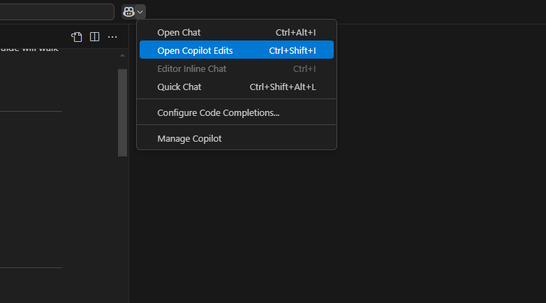
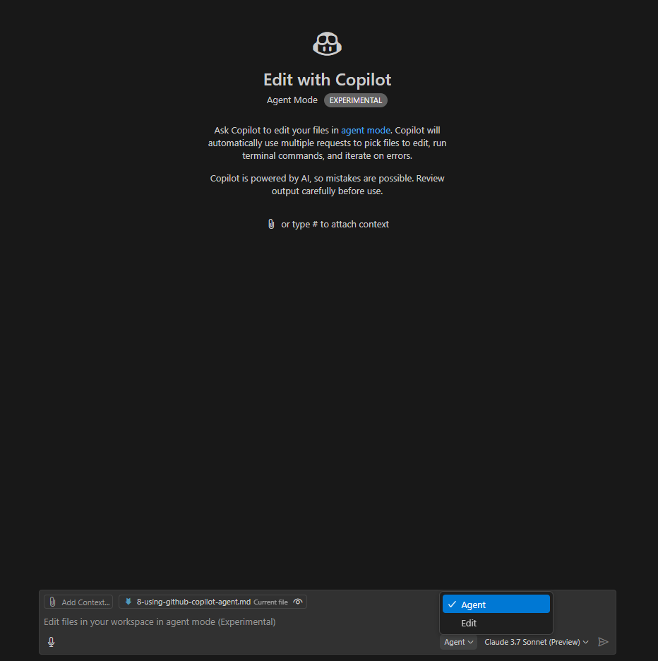

# Lesson 8: Using GitHub Copilot Agent

> **Availability Note:** GitHub Copilot Agent is currently available in Visual Studio Code Insiders as part of the nightly build. In the future, it may be included as a standard feature in Visual Studio Code. The features and interface described in this document may evolve as GitHub Copilot Agent moves toward general availability.

GitHub Copilot Agent takes AI assistance to the next level by enabling deeper and more interactive collaboration on your development projects. This guide will walk you through using GitHub Copilot Agent to create an ASP.NET Core Web API with MediatR pattern implementation.

## What is GitHub Copilot Agent?

Copilot Agent is an AI-powered assistant that can help you:

- Generate and implement entire features
- Create project structures and scaffolding
- Install and configure packages
- Implement architecture patterns
- Create tests

## Creating a C# ASP.NET Core Web API Project

Let's start by using GitHub Copilot Agent to create a new ASP.NET Core Web API project.

### Step 1: Launch GitHub Copilot Agent

To use GitHub Copilot Agent:

1. Open GitHub Copilot Edits by pressing `Ctrl+Shift+I` (Windows/Linux) or `Cmd+Shift+I` (Mac)

2. In the Copilot Edits panel, click the dropdown menu in the prompt box

3. Select "Agent" from the dropdown options

Now you're using Copilot Agent mode, which provides more interactive capabilities than the standard Copilot Chat.

Ask the Agent:

```
Create an ASP.NET Core WebAPI project in the samples/Agent directory. Name the project 'Agent.Api'. Use dotnet 8.0.
```

### Step 2: Follow the agent's instructions to create the project

Copilot will suggest using the .NET CLI to create the project.

### Step 3: Explore the project structure

Ask Copilot to explain the generated project structure:

```
Can you explain what files were created and their purposes?
```

Copilot will explain the key files in an ASP.NET Core Web API project:

The following are samples. (Your results may vary.)

- **Program.cs**: The entry point for the application
- **appsettings.json**: Configuration settings
- **Controllers/WeatherForecastController.cs**: Sample API controller
- **WeatherForecast.cs**: Sample model class
- **Properties/launchSettings.json**: Debug and launch configurations

## Installing and Setting Up MediatR

MediatR is a popular library for implementing the mediator pattern in .NET applications. Let's use Copilot Agent to add it to our project.

### Step 1: Ask Copilot Agent to add MediatR

Ask Copilot Chat:

```
I want to add MediatR to Agent.Api. Help me install the necessary packages and set it up.
```

Copilot Agent will suggest installing the MediatR packages and will offer to run the commands for you. It will typically suggest:

```bash
dotnet add package MediatR
dotnet add package MediatR.Extensions.Microsoft.DependencyInjection
```

Allow Copilot to run these commands for you by responding with "Yes, please run these commands."

### Step 2: Ask Copilot to help configure MediatR

After the packages are installed, ask Copilot:

```
Help me configure MediatR in Program.cs.
```

Copilot will analyze your Program.cs file and suggest the necessary code changes to register MediatR services, such as:

```csharp
using MediatR;

// ...existing code...

// Add MediatR services
builder.Services.AddMediatR(cfg => cfg.RegisterServicesFromAssemblyContaining<Program>());

// ...existing code...
```

Allow Copilot to make these changes for you or follow its guidance to update the file manually.

## Implementing a Query and Handler with MediatR

Now let's create a simple query and handler pattern using MediatR with Copilot's help.

### Step 1: Ask Copilot to create a folder structure

Ask Copilot:

```
I want to implement CQRS with MediatR. Help me create the necessary folders and files.
```

Copilot will suggest creating the following folder structure:
- Queries
- Commands
- Handlers
- Models

It may offer to run the commands to create these folders for you.

### Step 2: Ask Copilot to implement a query

Ask Copilot:

```
Create a WeatherForecastQuery class that uses MediatR.
```

Copilot will help you create a file named `Queries/WeatherForecastQuery.cs` with content similar to:

```csharp
using MediatR;
using Agent.API.Models;

namespace Agent.API.Queries
{
    public class WeatherForecastQuery : IRequest<IEnumerable<WeatherForecastResponse>>
    {
        // Query parameters can go here if needed
    }
}
```

### Step 3: Ask Copilot to create a response model

Ask Copilot:

```
Can you create a WeatherForecastResponse model class?
```

Copilot will help you create a file named `Models/WeatherForecastResponse.cs` with content similar to:

```csharp
namespace Agent.API.Models
{
    public class WeatherForecastResponse
    {
        public DateOnly Date { get; set; }
        public int TemperatureC { get; set; }
        public int TemperatureF => 32 + (int)(TemperatureC / 0.5556);
        public string? Summary { get; set; }
    }
}
```

### Step 4: Ask Copilot to create a query handler

Ask Copilot:

```
Can you create a handler for the WeatherForecastQuery?
```

Copilot will help you create a file named `Handlers/WeatherForecastQueryHandler.cs` with content similar to:

```csharp
using MediatR;
using Agent.API.Models;
using Agent.API.Queries;

namespace Agent.API.Handlers
{
    public class WeatherForecastQueryHandler : IRequestHandler<WeatherForecastQuery, IEnumerable<WeatherForecastResponse>>
    {
        private static readonly string[] Summaries = new[]
        {
            "Freezing", "Bracing", "Chilly", "Cool", "Mild", "Warm", "Balmy", "Hot", "Sweltering", "Scorching"
        };

        public Task<IEnumerable<WeatherForecastResponse>> Handle(WeatherForecastQuery request, CancellationToken cancellationToken)
        {
            var forecast = Enumerable.Range(1, 5).Select(index =>
                new WeatherForecastResponse
                {
                    Date = DateOnly.FromDateTime(DateTime.Now.AddDays(index)),
                    TemperatureC = Random.Shared.Next(-20, 55),
                    Summary = Summaries[Random.Shared.Next(Summaries.Length)]
                })
                .ToArray();

            return Task.FromResult<IEnumerable<WeatherForecastResponse>>(forecast);
        }
    }
}
```

### Step 5: Ask Copilot to create a controller

Ask Copilot:

```
Can you create an AgentController that uses the WeatherForecastQuery with MediatR?
```

Copilot will help you create a file named `Controllers/AgentController.cs` with content similar to:

```csharp
using MediatR;
using Microsoft.AspNetCore.Mvc;
using Agent.API.Models;
using Agent.API.Queries;

namespace Agent.API.Controllers
{
    [ApiController]
    [Route("[controller]")]
    public class AgentController : ControllerBase
    {
        private readonly IMediator _mediator;
        private readonly ILogger<AgentController> _logger;

        public AgentController(IMediator mediator, ILogger<AgentController> logger)
        {
            _mediator = mediator;
            _logger = logger;
        }

        [HttpGet("weather")]
        public async Task<ActionResult<IEnumerable<WeatherForecastResponse>>> GetWeatherForecast()
        {
            _logger.LogInformation("Retrieving weather forecast via MediatR");
            var query = new WeatherForecastQuery();
            var result = await _mediator.Send(query);
            return Ok(result);
        }
    }
}
```

## Testing Your API

Ask Copilot:

```
How can I run and test my API?
```

Copilot will suggest running your API with:

```bash
dotnet run
```

And will explain how to access:
- Swagger UI: https://localhost:[PORT]/swagger/index.html (The agent might show a different path. prompt to fix the path - "The swagger path in the url is incorrect. Give me the correct path to open Swagger")
- Direct API endpoint: https://localhost:[PORT]/agent/weather

It might also suggest using tools like Postman or curl to test your endpoint.

## Best Practices When Working with Copilot Agent

1. **Be specific in your requests** - The more details you provide, the more accurate the responses will be
2. **Break down complex tasks** - Ask for help with one component at a time
3. **Ask for explanations** - When Copilot generates code, ask it to explain how it works
4. **Iteratively refine** - If the first suggestion isn't perfect, provide feedback and ask for improvements

## Advanced Agent Techniques

### Code Refactoring

```
Can you help me refactor this controller to follow best practices?
```

### Generating Tests

```
Can you generate unit tests for my query handler?
```

### Documentation Generation

```
Can you generate XML documentation for my API endpoints?
```

## Extending the Project with More Features

Once you have the basic project set up, you can ask Copilot Agent to help you add more features:

1. **Add a Command Pattern**:
   ```
   Can you create a CreateWeatherForecastCommand and handler?
   ```

2. **Implement Validation**:
   ```
   Can you add FluentValidation to validate my commands?
   ```

3. **Add Authentication**:
   ```
   How do I add JWT authentication to my API?
   ```

4. **Implement a Repository Pattern**:
   ```
   Can you help me implement a repository pattern for data access?
   ```

## Source Control with GitHub

GitHub Copilot Agent can help you manage source control operations efficiently. Here are some example prompts you can use to ask Copilot Agent to handle common GitHub operations:

### Branch Management

1. **Create a new branch:**
   ```
   Create a new branch called 'feature/add-weather-validation' from main for implementing request validation in the weather forecast API
   ```

2. **Check your current branch and status:**
   ```
   Show me my current branch and what files are modified
   ```

3. **Switch between branches:**
   ```
   Switch to the main branch and then back to my feature branch
   ```

### Committing Code

1. **Stage and commit specific files:**
   ```
   Stage and commit the changes to the Controllers and Validators folders with the message "Add validation to weather forecast endpoints"
   ```

2. **Generate a meaningful commit message:**
   ```
   Help me write a descriptive commit message for my changes to the MediatR handlers
   ```

3. **Stage and commit all changes:**
   ```
   Stage all my changes and commit them with a message describing what I've accomplished
   ```

### Pushing and Pull Requests

1. **Push your branch:**
   ```
   Push my feature/add-weather-validation branch to the remote repository
   ```

2. **Create a pull request description:**
   ```
   Generate a pull request description for my feature/add-weather-validation branch that explains the validation features I added
   ```

3. **Check the status before pushing:**
   ```
   Run through a pre-push checklist: verify tests pass and check for uncommitted changes
   ```

### Complete Workflow Examples

1. **Full feature development workflow:**
   ```
   I finished implementing the weather validation feature. Help me create a new branch called 'feature/add-weather-validation', commit my changes with a descriptive message, and push to the remote repository
   ```

2. **Issue-based workflow:**
   ```
   I'm working on GitHub issue #42 to add pagination. Create a branch called 'feature/add-pagination', help me commit my changes, and push to GitHub
   ```

3. **Prepare for code review:**
   ```
   I need to submit my code for review. Help me ensure all changes are committed to my 'feature/user-preferences' branch and push it to GitHub
   ```

## Conclusion

GitHub Copilot Agent dramatically accelerates your development workflow by providing interactive assistance throughout your development process. By leveraging its capabilities, you can focus more on business logic and less on boilerplate code and configuration.

Remember that while Copilot Agent provides valuable assistance, always review the code it generates to ensure it meets your specific requirements and security standards.