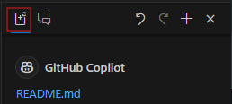

# Hands-On Lab: Development with GitHub Copilot  
## Overview
**Goal:**  
In this lab, you will learn how to use GitHub Copilot features such as autocomplete, inline chat, chat view, and Copilot CLI to enhance the OrderingService by adding a method to calculate order totals, considering discounts and taxes. You will also explore how to use GitHub Copilot to generate code, understand existing code, fix errors, and streamline shell command creation. Additionally, you will leverage Copilot Edit to refactor and improve code efficiently.  

**Estimated Duration:**  
30 - 45 minutes

**Audience:**  
 Developers, QA testers, DevOps engineers, and Technical Writers.

**Prerequisites:**  
To successfully complete this lab, ensure you have the following:

- **Access to GitHub Copilot:** You must have an active GitHub Copilot subscription.
- **Visual Studio Code (VS Code):** Installed and set up for development.
- **GitHub Copilot Extension for VS Code:** Installed and properly configured in VS Code.
- **GitHub CLI (gh):** Installed on your local machine.
- **GitHub Copilot CLI Extension:** Installed and connected to your GitHub account via GitHub CLI.

> **Note:** If you have not completed any of the above steps, please refer to [Lesson 1: Installing and Configuring GitHub Copilot](docs/lesson1.md) for detailed instructions.

## Copilot Chat
GitHub Copilot Chat provides an interactive way to engage with Copilot, offering more space and deeper ways to interact with your code. With the Chat View, you can ask natural language questions about the current context in your editor, request code suggestions, and optimize your code with Copilot's help.
1. **Navigate to the eShop solution**
Open a terminal window and change directory to the samples/eshop folder:
cd samples/eshop
2. **Set Copilot Model to GPT-4o**
Open the Copilot Chat pane in Visual Studio Code by clicking the Copilot icon in the sidebar or using the command palette (`Ctrl+Alt+I`). In the chat settings, ensure the model is set to GPT 4o. If it’s not already selected, switch the model to GPT 4o in the Copilot settings.   
>**Note**: We will use this model for this lesson. In later lessons we will experiment with utilizing other models for various tasks such as testing and documentation.  

3. In the Chat View prompt, you can use natural language to ask about current context (files open in the editor).   
&emsp;For example, browse to `src/Ordering.API/Apis` folder and open 'OrdersApi.cs' file. enter "how does this service work?" and press Enter.
4. Observe the GitHub Copilot response.
5. Alternatively, you can just enter one of the / commands, like /explain to get similar result.
6. You can continue dialog within the same context.  
&emsp;For example, enter "how can I optimize logging in this code?" and press Enter.
6. Observe the suggested code changes.

7. (Optional) You can copy parts of or the whole suggested code and paste in the editor manually, or click appropriate icon above the code view to Insert at Cursor, Apply in Editor, or just copy to clipboard.
8. (Optional) Save the file.

#### Additional Notes
For more details on these, see [Getting started with prompts for Copilot Chat](https://docs.github.com/en/copilot/using-github-copilot/guides-on-using-github-copilot/getting-started-with-prompts-for-copilot-chat)

## Inline Chat  
Now, let’s start by enhancing the OrderingService by leveraging inline chat feature. Our task is to add a method for calculating order totals, considering discounts and taxes.  

 
1. **Navigate to Ordering.Domain folder**  
   In Visual Studio Code, navigate to the `samples/eshop/src/Ordering.Domain/AggregatesModel/OrderAggregate` folder. Open the `Order` class file for modification.  
2. **Rename the GetTotal Method Using Copilot**  
   Before we add a method named CalculatedTotal that includes taxes, we need to rename existing GetTotal method to GetSubTotal  
   Use GitHub Copilot to rename the `GetTotal` method to `GetSubTotal`. 
   - Scroll to the bottom of the Order class and select `GetTotal` public member
   - Open inline Co-pilot Prompt with (`Ctrl+I`), and enter the following prompt:  

     ```plaintext
     Rename symbol `GetTotal` to `GetSubTotal`
     ```
3. **Add new GetTotal method**  
   In the inline chat, enter the following prompt:  
     ```plaintext
     Add a new public member named GetTotal that is calculated as sum of order items and a new public property of type decimal named taxes and subtracts the sum of items in a public property of type List<decimal> named Discounts 
     ```  
4. **Rewrite Discount Logic**  
   Now lets update the logic for discount to use the Discount property of `OrderItem` class. 
   - In the inline chat, enter the following prompt:   
   ```plaintext
     Add an empty public member named GetOrderDiscounts that returns a decimal
     ```
   - Click Accept of the inline chat to close the window.  
   - delete the return statement
   - Observe "ghost text" suggested by GitHub Copilot.
   - You can accept by pressing Tab key, or accept part word by word by using Ctrl-Arrow keys. Press Tab to accept the code.  
   - Open Inline chat again (`Ctrl+I`), enter the following prompt
   ```plaintext
      Update `GetOrderDiscounts` method to use use `Discount` property in OrderItem
   ```
   - This would replace the logic to calculate the order discount by adding up the discounts on each line item
   - Finally, in the `GetTotal` method, if you delete the value assigned to `totalDiscounts` variable, you should see the new `GetOrderDiscounts` method. Enter Tab to accept changes

## Copilot Edits
Using inline chat is very helpful in make quick updates on the go as you're working thru a user story or resolving a bug. However, you might've encountered some challenges with context especially when changes involve large code changes.   

In this section we will repeat the previous steps using Copilot Edits to showcase how we could accomplish the same results more efficiently.  

1. **Undo changes**  
Undo all changes made to `Order` class
2. **Open Copilot Chat**  
Open chat by clicking on the Copilot button at the bottom right hand side corner, this will open up a Copilot menu, select Github Copilot chat
3. **Copilot Edits view**
Select the Copilot Edits button (see below)  at the top left corner of the chat window:

    
4. **Add Order file to the context**
Click `+Add Files` and select Order.cs to add the `Order` class to the context
5. **Add Prompt to refactor GetTotal method**
Now add the following prompt to refactor the `GetTotal` public member to include taxes and discounts in calculation of order total
```plaintext
Refactor the GetTotal method to include taxes and discounts. get the taxes from a new public property named Taxes and the discounts is sum of discount property for each orderitem in the order
```  
You will notice that instead of generating code snippets like `Inline Chat`, copilot edits parses the entire Order class and modifies the logic accordingly. 


## Copilot CLI
**Description:**  
GitHub Copilot CLI offers an efficient way to interact with Copilot directly from the command line. With Copilot CLI, you can generate shell commands and automate tasks with ease, making it a powerful tool for developers who prefer working in a terminal environment.


**Instructions:**  
1. In VS Code, press Ctrl+\` to open a new terminal if necessary.  
2. In the terminal window enter the following command:  
   ```bash
   gh copilot --help
   ```
3. Observe the command usage help and try some of the commands, e.g.:
   ```bash
   gh copilot suggest "list commits in the last 3 days"
   ```
   When prompted:  
   ? What kind of command can I help you with?  
   &gt; generic shell command  
   &emsp;gh command  
   &emsp;git command  
   press Enter to select generic shell command

   When prompted:  
   ? Select an option  [Use arrows to move, type to filter]  
   &gt; Copy command to clipboard  
   &emsp;Explain command  
   &emsp;Execute command  
   &emsp;Revise command  
   &emsp;Rate response  
   &emsp;Exit  

   You can select any of the listed options using up-down arrow keys and pressing Enter.
   Try few different options and select Exit to end.

## Conclusion

**Summary:**  
You have learned basics of several major features of GitHub Copilot, including:  
- Autocomplete
- Inline Chat
- Copilot Chat
- Copilot Edits
- Copilot CLI

**Next Steps:**  
- [Lesson 3: Testing with GitHub Copilot](docs/lesson3.md)

