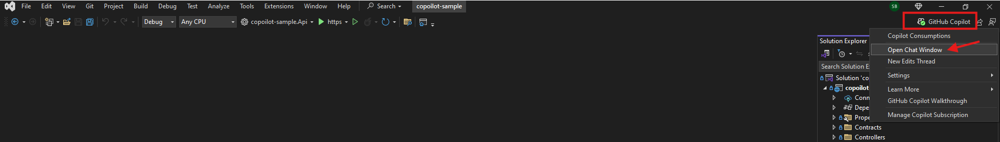

# 🚀 Lesson 1: Installing and Configuring GitHub Copilot

---

## 📝 Overview

**Goal:**

> Learn how to install and configure GitHub Copilot in Visual Studio Code and Visual Studio 2022.

**Estimated Duration:** 10-15 minutes  
**Audience:** Developers, QA testers, DevOps engineers, Technical Writers  
**Prerequisites:**

- Visual Studio Code (version 1.101.1 or higher) and/or Visual Studio 2022 installed
- GitHub Copilot license
- Active internet connection for updates and authentication

---

## 🛠️ How to Install GitHub Copilot in VS Code

### 🔄 Update Visual Studio Code (If Already Installed)

If you already have VS Code installed, ensure you're running the latest version:

1. **Open Visual Studio Code.**
2. Go to **Help** > **Check for Updates** (or **Code** > **Check for Updates** on macOS).
3. If an update is available, click **Download Update** and restart VS Code.
4. Alternatively, you can check your version by going to **Help** > **About** and compare it with the latest version on the [VS Code website](https://code.visualstudio.com/).

### 📦 Install GitHub Copilot Extension

1. **Open Visual Studio Code.**
2. Go to the **Extensions** view by clicking the square icon in the sidebar or pressing `Ctrl+Shift+X`.
3. Search for **GitHub Copilot**.
4. Click **Install** on the GitHub Copilot extension by GitHub.
5. After installation, sign in with your GitHub account when prompted.

### ➕ Add Your GitHub Account to VS Code

1. Open the **Command Palette** (`Ctrl+Shift+P`).
2. Type and select **"GitHub: Sign in"**.
3. Follow the prompts to sign in with your GitHub account.
4. Authorize VS Code to access your GitHub Copilot subscription.

> ℹ️ [Install GitHub Copilot in VS Code – Official Docs](https://docs.github.com/en/copilot/getting-started-with-github-copilot/getting-started-with-github-copilot-in-visual-studio-code)

## 💬 How to Open Copilot Chat in VS Code

To access Copilot Chat in Visual Studio Code:

1. **Method 1:** Click the **Chat** icon in the Activity Bar (left sidebar).
2. **Method 2:** Open the **Command Palette** (`Ctrl+Shift+P`) and type **"GitHub Copilot: Open Chat"**.
3. **Method 3:** Use the keyboard shortcut `Ctrl+Shift+I` (or `Cmd+Shift+I` on macOS).

The Copilot Chat panel will open, where you can:
- Ask questions about your code
- Request code explanations
- Get help with debugging
- Generate code snippets

> ℹ️ [GitHub Copilot Chat in VS Code – Official Docs](https://code.visualstudio.com/docs/copilot/copilot-chat)

## 🛠️ How to Install GitHub Copilot in Visual Studio 2022

### 🔄 Update Visual Studio 2022 (If Already Installed)

If you already have Visual Studio 2022 installed, ensure you're running the latest version:

1. **Open Visual Studio Installer** (search for it in the Start menu).
2. If Visual Studio Installer needs an update, it will prompt you to update it first.
3. Find your Visual Studio 2022 installation and click **Update** if available.
4. Wait for the update to complete and restart Visual Studio if prompted.
5. Alternatively, within Visual Studio 2022, go to **Help** > **Check for Updates**.

> ⚠️ **Important:** For the best GitHub Copilot experience, use the latest version of Visual Studio 2022.

### 📦 Install GitHub Copilot Extension

1. **Open Visual Studio Installer.**
2. Click **Modify** for your Visual Studio 2022 installation.
3. In the **Workloads** tab, select any workload (e.g., **ASP.NET and web development**).
4. Under **Optional components**, check **GitHub Copilot**.
5. Click **Modify** to install the tool.

### ➕ Add Your GitHub Account to Visual Studio

1. Open Visual Studio 2022.
2. Go to **File** > **Account Settings**.
3. Click **Add an account**.
4. Select **GitHub** and sign in.
5. Authorize Visual Studio to access your GitHub account.

> ℹ️ [Install and Manage GitHub Copilot in Visual Studio](https://learn.microsoft.com/en-us/visualstudio/ide/visual-studio-github-copilot-install-and-states?view=vs-2022)
> ℹ️ [Add your GitHub account to Visual Studio](https://learn.microsoft.com/en-us/visualstudio/ide/work-with-github-accounts?view=vs-2022#add-a-github-account-from-the-account-settings-dialog)

---

## 💬 How to Open Copilot Chat in Visual Studio 2022

To open the Copilot chat:

1. Click the Copilot icon in the top right corner of Visual Studio.
2. Select **Open Chat Window**.

> ℹ️ [Visual Studio GitHub Copilot Chat Documentation](https://learn.microsoft.com/en-us/visualstudio/ide/visual-studio-github-copilot-chat?view=vs-2022)



The Copilot chat window will appear on the right side. The header includes:

- **Chat thread dropdown:** View chat history.
- **Create new thread button:** Start a new chat thread.
- **Edit thread button:** Edit the current chat.
- **Delete thread button:** Remove the current thread.


---

## ✅ Verification and Testing

### 🔍 Verify Installation Success

After installation, verify that GitHub Copilot is working correctly:

**For VS Code:**
1. Open any code file (e.g., `.js`, `.py`, `.cs`)
2. Start typing a function or comment
3. You should see Copilot suggestions appear in gray text
4. Press `Tab` to accept a suggestion
5. Open Copilot Chat and ask: "Hello, are you working?"

**For Visual Studio 2022:**
1. Open or create a new C# file
2. Start typing a method or class
3. Look for Copilot suggestions appearing as you type
4. Open Copilot Chat and verify it responds to queries
5. Check that the Copilot icon shows as active (not grayed out)

### 🚨 Quick Test Commands

Try these test prompts in Copilot Chat to ensure everything is working:

```text
// Test basic functionality
Write a hello world function in C#

// Test workspace awareness (if you have a project open)
@workspace What programming language is this project using?

// Test code explanation
/explain [select any piece of code and run this command]
```

---

## 🔧 Troubleshooting Common Issues

### ❌ Copilot Not Showing Suggestions

**Possible Causes & Solutions:**

1. **Extension Not Enabled:**
   - VS Code: Check Extensions panel, ensure GitHub Copilot is enabled
   - Visual Studio: Go to Extensions > Manage Extensions, verify Copilot is installed and enabled

2. **Not Signed In:**
   - Verify you're signed into GitHub with a Copilot-enabled account
   - Check account status in the bottom status bar

3. **Network/Firewall Issues:**
   - Ensure internet connectivity
   - Check corporate firewall settings allow GitHub domains
   - Try disabling VPN temporarily

4. **File Type Not Supported:**
   - Copilot works with most programming languages
   - Try creating a `.cs`, `.js`, or `.py` file for testing

### ❌ "Copilot Disabled" or Grayed Out Icon

**Solutions:**
1. **License Check:** Verify your GitHub account has an active Copilot subscription
2. **Org Policies:** Check if your organization has disabled Copilot for your repositories
3. **Repository Settings:** Some repositories may have Copilot disabled via `.copilotignore` files

### ❌ Chat Not Responding

**Solutions:**
1. **Restart IDE:** Close and reopen VS Code or Visual Studio
2. **Clear Chat:** Start a new chat thread
3. **Check Network:** Ensure stable internet connection
4. **Update Extension:** Check for Copilot extension updates

---

## 🏢 Enterprise and Team Considerations

### 🔒 Security and Compliance

**For Enterprise Environments:**

1. **Data Privacy Settings:**
   - Review GitHub Copilot's data usage policies
   - Configure appropriate settings for proprietary code
   - Consider GitHub Copilot Business for enhanced privacy controls

2. **Organization Policies:**
   - Work with IT to ensure GitHub domains are allowlisted
   - Understand your organization's AI tool usage policies
   - Configure appropriate access controls for team members

3. **Code Review Processes:**
   - Establish guidelines for reviewing Copilot-generated code
   - Train team members on validating AI suggestions
   - Implement code quality checks for AI-assisted development

### 👥 Team Setup Best Practices

1. **Consistent Configuration:**
   - Ensure all team members use the same Copilot version
   - Share workspace settings and preferences
   - Document team coding standards for Copilot usage

2. **Training and Onboarding:**
   - Provide Copilot training for new team members
   - Establish best practices for prompt engineering
   - Share effective usage patterns across the team

---

## ⚙️ Advanced Configuration

### 🎛️ Customizing Copilot Settings

**VS Code Settings:**
1. Open Settings (`Ctrl+,`)
2. Search for "Copilot"
3. Configure preferences such as:
   - Enable/disable suggestions for specific languages
   - Adjust suggestion delay
   - Configure chat model preferences

**Visual Studio Settings:**
1. Go to **Tools** > **Options**
2. Navigate to **IntelliCode** > **GitHub Copilot**
3. Adjust settings for:
   - Suggestion behavior
   - Chat preferences
   - Model selection

### 🔧 Workspace-Specific Settings

Create a `.vscode/settings.json` file in your project root:

```json
{
  "github.copilot.enable": {
    "*": true,
    "yaml": false,
    "plaintext": false
  },
  "github.copilot.advanced": {
    "length": 500,
    "temperature": 0.1
  }
}
```

---

## 🚀 Performance Optimization

### ⚡ Improving Response Times

1. **Network Optimization:**
   - Use stable, high-speed internet connection
   - Consider proximity to GitHub servers for better latency

2. **IDE Performance:**
   - Close unnecessary extensions
   - Ensure adequate system resources (RAM, CPU)
   - Keep IDE updated to latest version

3. **Usage Patterns:**
   - Be specific in your prompts for faster, more relevant responses
   - Use context-specific commands (@workspace, /explain, etc.)
   - Break complex requests into smaller, focused prompts

---

## 📊 Monitoring and Analytics

### 📈 Usage Tracking

**GitHub Copilot provides usage analytics:**

1. **Personal Usage:**
   - Visit [github.com/settings/copilot](https://github.com/settings/copilot)
   - Review suggestion acceptance rates
   - Monitor language usage patterns

2. **Organization Analytics:**
   - Organization owners can view team usage statistics
   - Track adoption rates across development teams
   - Monitor productivity improvements

---

## ✅ Next Steps

You are now ready to use GitHub Copilot in your favorite IDE! Explore Copilot's features to boost your productivity.

**Recommended Next Actions:**
1. **Complete the Getting Started Labs:** Explore @workspace, Ask, Edit, and Agent features
2. **Configure Team Settings:** Set up consistent configurations for your development team
3. **Practice Effective Prompting:** Learn best practices for communicating with Copilot
4. **Integrate with Workflow:** Incorporate Copilot into your daily development routine

---
