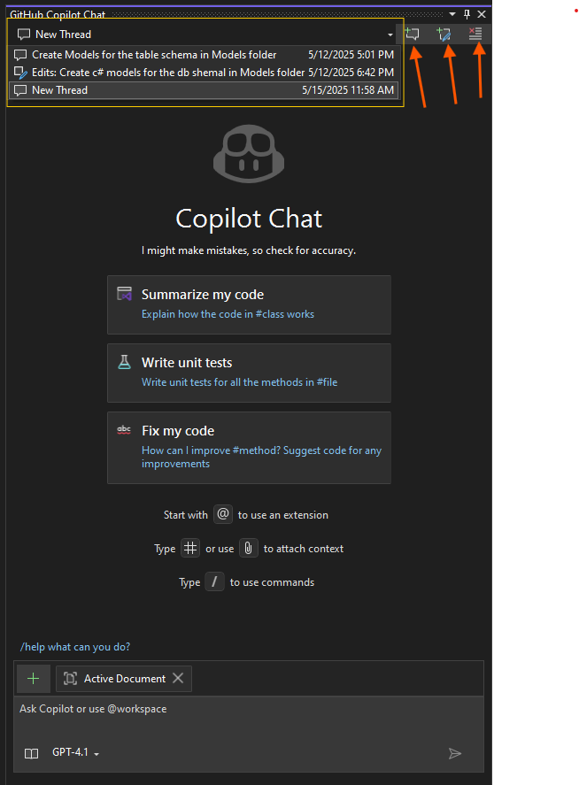

# 🚀 Lesson 1: Installing and Configuring GitHub Copilot

---

## 📝 Overview

**Goal:**

> Learn how to install and configure GitHub Copilot in Visual Studio Code, Visual Studio 2022, and JetBrains IDEs.

**Estimated Duration:** 10-15 minutes  
**Audience:** Developers, QA testers, DevOps engineers, Technical Writers  
**Prerequisites:**

- Visual Studio Code and/or Visual Studio 2022 and/or JetBrains IDE installed
- GitHub Copilot license

---

## 🛠️ How to Install GitHub Copilot in VS Code

1. **Open Visual Studio Code.**
2. Go to the **Extensions** view by clicking the square icon in the sidebar or pressing `Ctrl+Shift+X`.
3. Search for **GitHub Copilot**.
4. Click **Install** on the GitHub Copilot extension by GitHub.
5. After installation, sign in with your GitHub account when prompted.

### ➕ Add Your GitHub Account to VS Code

1. Open the **Command Palette** (`Ctrl+Shift+P`).
2. Type and select **"GitHub: Sign in"**.
3. Follow the prompts to sign in with your GitHub account.
4. Authorize VS Code to access your GitHub Copilot subscription.

> ℹ️ [Install GitHub Copilot in VS Code – Official Docs](https://docs.github.com/en/copilot/getting-started-with-github-copilot/getting-started-with-github-copilot-in-visual-studio-code)

---

## 🛠️ How to Install GitHub Copilot in JetBrains IDEs (IntelliJ, PyCharm, WebStorm, etc.)

1. **Open your JetBrains IDE** (e.g., IntelliJ IDEA, PyCharm, WebStorm).
2. Go to **File > Settings > Plugins** (or **Preferences > Plugins** on macOS).
3. Search for **GitHub Copilot** in the Marketplace tab.
4. Click **Install** on the GitHub Copilot plugin by GitHub.
5. Restart your IDE if prompted.

### ➕ Add Your GitHub Account to JetBrains IDEs

1. Go to **File > Settings > GitHub Copilot** (or **Preferences > GitHub Copilot** on macOS).
2. Click **Sign in** and follow the prompts to authenticate with your GitHub account.
3. Authorize the IDE to access your Copilot subscription.

> ℹ️ [Install GitHub Copilot in JetBrains IDEs – Official Docs](https://docs.github.com/en/copilot/getting-started-with-github-copilot/getting-started-with-github-copilot-in-your-jetbrains-ide)

---

## 🛠️ How to Install GitHub Copilot in Visual Studio 2022

1. **Open Visual Studio Installer.**
2. Click **Modify** for your Visual Studio 2022 installation.
3. In the **Workloads** tab, select any workload (e.g., **ASP.NET and web development**).
4. Under **Optional components**, check **GitHub Copilot**.
5. Click **Modify** to install the tool.

### ➕ Add Your GitHub Account to Visual Studio

1. Open Visual Studio 2022.
2. Go to **File** > **Account Settings**.
3. Click **Add an account**.
4. Select **GitHub** and sign in.
5. Authorize Visual Studio to access your GitHub account.

> ℹ️ [Install and Manage GitHub Copilot in Visual Studio](https://learn.microsoft.com/en-us/visualstudio/ide/visual-studio-github-copilot-install-and-states?view=vs-2022)
> ℹ️ [Add your GitHub account to Visual Studio](https://learn.microsoft.com/en-us/visualstudio/ide/work-with-github-accounts?view=vs-2022#add-a-github-account-from-the-account-settings-dialog)

---

## 💬 Open Copilot Chat in Visual Studio

To open the Copilot chat:

1. Click the Copilot icon in the top right corner of Visual Studio.
2. Select **Open Chat Window**.

> ℹ️ [Visual Studio GitHub Copilot Chat Documentation](https://learn.microsoft.com/en-us/visualstudio/ide/visual-studio-github-copilot-chat?view=vs-2022)

The Copilot chat window will appear on the right side. The header includes:

- **Chat thread dropdown:** View chat history.
- **Create new thread button:** Start a new chat thread.
- **Edit thread button:** Edit the current chat.
- **Delete thread button:** Remove the current thread.

---

## ✅ Next Steps

You are now ready to use GitHub Copilot in your favorite IDE! Explore Copilot's features to boost your productivity.

---
