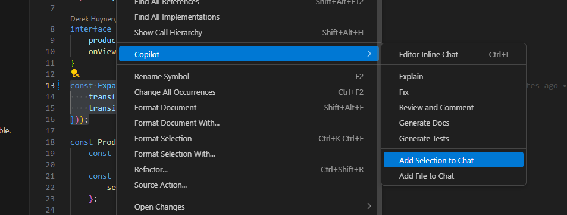
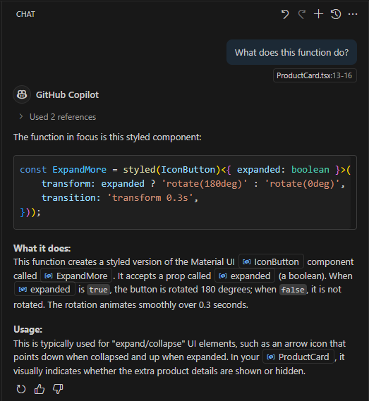
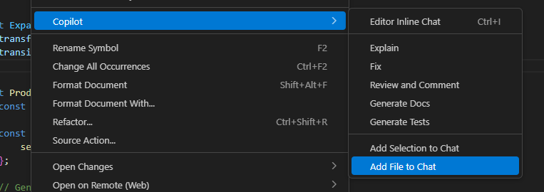
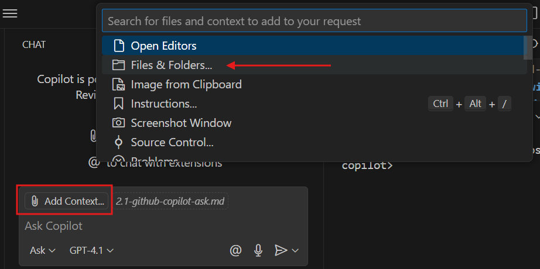
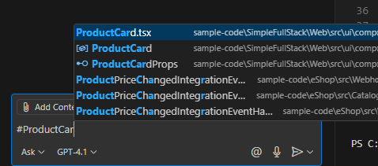

# 🚀 Getting Started with GitHub Copilot Ask

---

### 📝 Overview

Github Copilot Ask is one of three modes of GitHub Copilot (Ask, Edit, Agent), designed to help you understand and improve your code. 

---

### 🎯 Goal

The goal of this lesson is to introduce you to GitHub Copilot Ask. You will learn how to use it effectively to get explanations, debug issues, and improve your understanding of the codebase you are working on.

---

### ⏱️ Estimated Time

5-10 minutes

---

### 👥 Participants

Everyone (Developers, QA testers, DevOps engineers, Technical Writers, and more)

---

## What Is GitHub Copilot Ask?

GitHub Copilot Ask is a conversational tool built into your code editor that acts like a helpful programming mentor. It allows you to ask natural language questions—just like you would ask a colleague—and get immediate answers. What makes it especially powerful is that it works right inside your development environment, so you don't have to switch tabs, search the web, or dig through documentation. You can simply highlight a piece of code, ask a question in plain English, and get a response that helps you understand, debug, or improve your code—all without making any changes to your files.

This feature is designed to support you when you're stuck, curious, or learning something new. Whether you're trying to understand what a function does, figure out how to write a test, explore alternative approaches, or brush up on a programming concept, Copilot Ask is there to guide you. It's especially useful for developers who are still learning or working in unfamiliar codebases, as it can explain complex logic, suggest best practices, and help you build confidence in your understanding.

GitHub Copilot Ask:

### Key Features:

- **Zero Code Changes**: Pure guidance mode - explains, suggests, teaches
- **Context-Aware**: Understands your highlighted code and project structure  
- **Conversational**: Natural language questions get natural language answers
- **Educational Focus**: Perfect for learning and understanding complex code

---
## How It Works – Step by Step

Here's how to use GitHub Copilot Ask effectively:

1. **Highlight the Code You Have Questions About**
   - Select the specific block of code you want help with.

     

   - This gives Copilot Ask the context it needs to give a relevant answer.
   - 💡 Tip: The more specific your selection, the better the answer.

   **What does "context" mean?**  
   Context refers to the surrounding information and circumstances that help determine the meaning or correct response to something. Think of it like having a conversation, you need to know what you're talking about to give a relevant answer.

2. **Add the selection to the Copilot Chat**
   - After highlighting, right click and choose "Copilot" in the popup menu.
   - Select "Add Selection to Chat".

     

3. **Open the Copilot Chat Panel**
   - Open the Copilot Chat panel if it is not already open.
   - You can do this by clicking the Copilot icon in the sidebar or using the command palette (`Ctrl+Shift+P` on Windows/Linux or `Cmd+Shift+P` on Mac, then search for "Chat: Open Chat (Ask)").

     

   💡 You will notice that the section you highlighted appears in the chat with the lines selected

4. **Ask Your Question**
  You don't need to use special syntax. Just ask like you would ask a colleague.

  - Type your question in the chat input box at the bottom of the Copilot Chat panel.
  - Click the send button (arrow icon) or press Enter to dispatch your question.

  - For example:
    - "What does this function do?"
    - "How can I improve this code?"
    - "Why is this error happening?"
    - "Can you explain how to test this component?"

  ⚠️ It is important to stay in the file of the selection you have chosen, copilot uses this file to build context along with the selection you have made. If you switch files, it may not be able to provide the best answer.

5. **Review the Response**

   Copilot Ask will typically respond with a combination of helpful resources tailored to your question. This may include a plain-English explanation that breaks down what the code is doing or clarifies a concept, along with suggestions or alternative approaches you might consider. It often provides relevant code snippets to illustrate its points, and in some cases, it may include links to official documentation or trusted sources for further reading.

   Next, you can ask follow-up questions to go deeper or clarify something.

     

---

## Other Ways to Use GitHub Copilot Ask

1. **Ask without context**
   - While Copilot Ask works great when you highlight code to provide context, it's also designed to function as a general-purpose coding assistant—even when you don't select any code at all. This means you can simply open the chat panel and ask a question in plain English, and Copilot Ask will respond with helpful, relevant information
    - For example, you can ask "What's the difference between let, var, and const in JavaScript?" or "What are the best practices for error handling in Python?"

2. **Ask about an entire file**
   - If you want to understand a whole file, you can select the entire file.
   - For example, "What is the purpose of this file?" or "How does this module fit into the overall architecture?"

     1. As long as you have the file open, copilot will automatically add the file to the chat. You will notice if you switch between files, the chat will update to reflect the file you are currently in.

        

    2. **Alternative Method 1:** Right click in the file then select "Copilot" and "Add File to Chat" in the popup menu.

       

    3. **Alternative Method 2:** Click the Add Context button in the chat panel, then select "File and Folders" or search for a specific file.

       
    
    4. **Alternative Method 4:** Drag and drop the file from your file explorer directly into the chat panel.

       Steps:
       1. Open your file explorer and locate the file you want to add.
       2. Click and hold the file, then drag it into the Copilot Chat panel in VS Code.
       3. Release the mouse button to drop the file—Copilot will automatically add the file context to your chat.

    5. **Alternative Method 5:** Use the '#' symbol to reference a specific file in your question, like `#ProductCard.tsx`. This will automatically add the file context to your chat.

       

3. **Including Multiple Forms of Context**
   - When you're working on a real-world project, your questions might involve more than just a single line or file of code. You might be trying to understand how two components interact, how a function in one file affects behavior in another, or how a shared utility is used across different parts of your app. That's where including multiple forms of context becomes incredibly useful.

     GitHub Copilot Ask allows you to bring in multiple pieces of code from different files or locations into a single conversation. This gives Copilot a broader view of what you're working on, so it can provide more accurate, connected, and insightful answers.

     - Just highlight the code, right-click, and select "Add Selection to Chat" or "Add File to Chat" for every piece of context you want to include (or use any method described above).
     - Each piece of context will be added to the chat, and you can ask questions that reference all of them.
     - For example, "How does this function in `ProductCard.tsx` relate to the class in `ProductsGrid.tsx`?" or "What are the dependencies between these two components?"

       

4. **Ask About Your Entire Project**
   - Sometimes, your questions aren't just about a single function or file—they're about how your entire project is structured or behaves. That's where the @workspace agent comes in. It allows you to ask Copilot Ask questions that span across your whole codebase, rather than being limited to just the code you've highlighted.

     The @ symbol is used to reference a specific scope or agent within Copilot Chat. When you type @workspace, you're telling Copilot to consider the full context of your project—its files, folders, dependencies, and architecture—when generating a response. This is incredibly useful for understanding high-level design, identifying patterns, or exploring how different parts of your codebase interact (especially if you're new to a project).

     

---

#### 🚨 Common Mistakes to Avoid:

1. **Not Highlighting Relevant Code**: Always select the code you're asking about
2. **Expecting Code Changes**: Remember, Ask mode is for guidance, not edits
3. **Not Building on Responses**: Use follow-up questions to dive deeper
4. **Asking for Complete Solutions**: Instead, ask for approaches or explanation
5. **Asking Vague Questions**: Be clear and specific to get the best answers
   - ❌ "Fix my code"
6. **Asking Multiple Questions at Once**: Keep it focused, split out complex questions
   - ❌ "Explain this function, optimize it, and also tell me about testing strategies"

---

## 🧪 Labs

Complete the hands-on exercises to master GitHub Copilot Ask:

- [Exploring GitHub Copilot Ask with C#](c#/2.2-exploring-copilot-ask.md) (C# Orders API)
- [Exploring GitHub Copilot Ask with React](react/2.1-exploring-copilot-ask-(react).md) (React)

---

© Copyright Neudeisc 2025