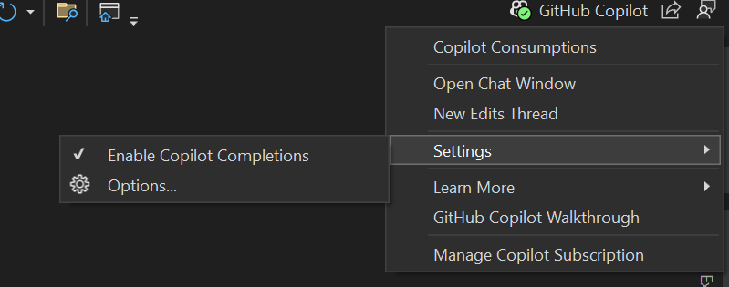
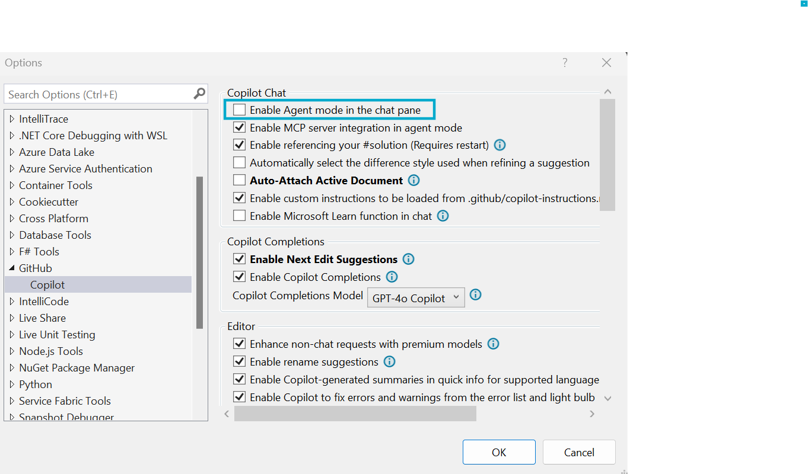

# 🧪 Lab: Building E-commerce Features with GitHub Copilot Agent

---

## 📝 Overview

**Goal:**  
Learn how to leverage GitHub Copilot Agent to autonomously implement complex e-commerce features and architectural changes in an Orders API using Visual Studio 2022. Experience how Agent mode can accelerate development by implementing complete features across multiple files.

**Estimated Duration:** 25-30 minutes

**Audience:**  
.NET Core Web API developers, E-commerce developers, Backend engineers.

**Prerequisites:**

- Visual Studio 2022 installed (17.14.6 or later)
- GitHub Copilot subscription with Agent capabilities enabled
- Access to the Orders API sample project
- Basic familiarity with ASP.NET Core Web API concepts and DDD patterns

**Project Folder:**  
[Orders API Sample Project](../../../../sample-code/Orders/README.md)

---

## 🎯 What Makes Copilot Agent Powerful?

Unlike Ask which provides guidance, and @workspace which analyzes projects, **Copilot Agent** excels at:

- **Autonomous Implementation** - Automatically creates and modifies multiple files
- **Cross-Project Changes** - Updates controllers, services, entities, and configurations together
- **Architecture-Aware Development** - Maintains existing patterns and conventions
- **Complete Feature Development** - Implements end-to-end functionality without manual coordination
- **Intelligent File Creation** - Creates new files in appropriate locations with proper structure

**Key Benefits:**
- 🚀 **Rapid Feature Development** - Complete features in minutes instead of hours
- 🏗️ **Architecture Consistency** - Maintains existing patterns across all changes
- 📁 **Multi-File Coordination** - Updates related files automatically
- 🔧 **Configuration Management** - Updates DI containers, routing, and settings
- 🧪 **Test Generation** - Creates comprehensive test suites alongside implementation

---

## 🧭 Lab Steps

### 1️⃣ **Setup Copilot Agent Mode**

**Enable Agent capabilities in Visual Studio 2022:**

1. **Open Visual Studio 2022** with the Orders.sln solution
2. **Navigate to Copilot Chat** by clicking the Copilot icon in the activity bar
3. **Access Settings** by clicking `Copilot icon > Settings > Options`
4. **Enable Agent Mode** by checking "Enable Agent mode in the chat pane" checkbox




**Verify Agent Mode:**
- Look for the Agent indicator in the chat interface
- You should see enhanced capabilities for autonomous code generation

**📝 Agent Mode Capabilities:**
Agent mode provides powerful autonomous development capabilities including:
- **Greater error iteration** - Automatically fixes issues and retries implementation
- **Tool integration** - Access to additional development tools and context
- **Automatic code application** - Directly applies changes without manual intervention
- **Multi-file coordination** - Manages changes across related files automatically

---

### 2️⃣ **Implement Order Status Management Feature**

**Use Agent to implement a complete order status tracking system:**

```text
@workspace, I need to implement order status management for this e-commerce Orders API. Please:

1. Add an OrderStatus enum with values: Pending, Confirmed, Processing, Shipped, Delivered, Cancelled
2. Update the Order entity to include Status property and status transition methods
3. Create an OrderStatusService with business logic for valid status transitions
4. Add new controller endpoints: PATCH /api/orders/{id}/status and GET /api/orders/status/{status}
5. Implement proper validation and error handling for invalid status transitions
6. Update the dependency injection configuration
7. Add appropriate logging for status changes

Follow the existing DDD patterns and ensure Entity Framework integration.
```

**What you'll observe:**
- Agent analyzes the existing Order domain structure
- Creates the OrderStatus enum in the appropriate location
- Updates Order.cs with status property and business methods
- Creates OrderStatusService with validation logic
- Adds new controller actions with proper HTTP verbs and routing
- Updates Program.cs for dependency injection
- Implements comprehensive error handling and logging
- Maintains consistency with existing coding patterns

**After completion:**
- Build the solution to verify compilation
- Review the generated code for pattern consistency
- Test the new endpoints using the generated .http file

---

### 3️⃣ **Enhance Order Management with Customer Integration**

**Implement customer management features:**

```text
@workspace, Enhance the Orders API with customer management capabilities:

1. Create a Customer entity with properties: Id, Name, Email, Address, Phone, RegistrationDate
2. Update Order entity to include CustomerId (foreign key) instead of CustomerName string
3. Create CustomerService with methods: CreateCustomer, GetCustomer, UpdateCustomer, GetCustomerOrders
4. Add CustomerController with full CRUD operations
5. Create CustomerDto and OrderDto classes for API responses
6. Implement AutoMapper configurations for entity-to-DTO mapping
7. Update OrderController to work with Customer entities
8. Add Entity Framework DbContext configuration for Customer entity
9. Create database migration scripts

Ensure all changes follow Clean Architecture principles and existing project patterns.
```

**What Agent will accomplish:**
- Creates Customer entity with proper relationships
- Refactors Order entity to use Customer foreign key
- Implements CustomerService with business logic
- Creates CustomerController with RESTful endpoints
- Generates DTO classes with appropriate validation attributes
- Sets up AutoMapper profiles for clean separation
- Updates OrderController for Customer integration
- Configures Entity Framework relationships
- Creates migration scripts for database updates

---

### 4️⃣ **Implement Order Analytics and Reporting**

**Add business intelligence capabilities:**

```text
@workspace, Implement order analytics and reporting features:

1. Create OrderAnalyticsService with methods to calculate:
   - Total revenue by date range
   - Top customers by order value
   - Popular products from order items
   - Average order value trends
   - Order status distribution

2. Add OrderReportsController with endpoints:
   - GET /api/reports/revenue?startDate={date}&endDate={date}
   - GET /api/reports/top-customers?limit={number}
   - GET /api/reports/order-trends?period={monthly|weekly|daily}
   - GET /api/reports/status-summary

3. Implement caching for expensive analytics queries using IMemoryCache
4. Add query optimization with proper Entity Framework includes
5. Create ReportDto classes for structured responses
6. Add OpenAPI documentation with examples for all endpoints
7. Implement proper error handling and validation

Focus on performance and scalability for large datasets.
```

**Agent capabilities demonstrated:**
- Complex business logic implementation across multiple services
- Performance-optimized Entity Framework queries
- Caching strategy implementation
- Comprehensive API documentation generation
- Structured DTO design for complex data
- Error handling and validation patterns

---

### 5️⃣ **Add Comprehensive Testing Suite**

**Generate complete test coverage:**

```text
@workspace, Create a comprehensive testing suite for the Orders API:

1. Generate xUnit test projects for:
   - Orders.Domain.Tests (unit tests for entities and services)
   - Orders.Api.Tests (integration tests for controllers)

2. Create unit tests for:
   - Order entity business methods (AddOrderItem, GetTotal, status transitions)
   - OrderService business logic and validation
   - CustomerService CRUD operations
   - OrderAnalyticsService calculation methods

3. Create integration tests for:
   - OrderController CRUD endpoints
   - CustomerController operations
   - OrderReportsController analytics endpoints
   - Order status workflow end-to-end scenarios

4. Use Moq for mocking dependencies (IOrderRepository, ICustomerRepository)
5. Implement TestContainers for database integration tests
6. Add test data builders/factories for consistent test setup
7. Follow AAA (Arrange-Act-Assert) pattern throughout
8. Include both positive and negative test scenarios

Ensure high code coverage and test maintainability.
```

**Comprehensive testing implementation:**
- Creates separate test projects with proper structure
- Generates unit tests with thorough coverage
- Implements integration tests with realistic scenarios
- Sets up proper mocking and test data strategies
- Creates maintainable test architecture
- Includes edge cases and error scenarios

---

### 6️⃣ **Implement Basic Deployment Configuration**

**Add essential deployment setup:**

```text
@workspace, Prepare this Orders API for basic production deployment:

1. Create containerization setup:
   - Simple Dockerfile optimized for .NET 8
   - docker-compose.yml for local development with SQL Server

2. Implement health checks:
   - Database connectivity check
   - Basic application health endpoint

3. Add configuration management:
   - Environment-specific appsettings files
   - Connection string configuration for different environments
   - Basic logging configuration

4. Create deployment scripts:
   - Simple deployment script for IIS or self-hosted scenarios
   - Database migration scripts
   - Environment setup instructions

Keep it simple and focused on single-server deployment scenarios.
```

**Basic deployment features:**
- Simple containerization for development
- Essential health monitoring
- Environment configuration management
- Straightforward deployment approach

---

## 🎨 **Advanced Agent Techniques for E-commerce**

### 🔄 **Multi-Stage Feature Development**

**Break complex features into coordinated stages:**

```text
@workspace, Implement order fulfillment workflow in stages:

Stage 1: Create InventoryService to check product availability
Stage 2: Add ReservationService for temporary stock holds
Stage 3: Implement PaymentService integration interfaces
Stage 4: Create FulfillmentService for order processing workflow
Stage 5: Add notification system for order status updates

Coordinate all services and ensure proper transaction handling.
```

### 🏗️ **Architecture Evolution**

**Evolve the architecture while maintaining existing functionality:**

```text
@workspace, Refactor this Orders API to implement CQRS pattern:

1. Separate read and write models
2. Implement command handlers for order operations
3. Create query handlers for data retrieval
4. Add event sourcing for order state changes
5. Maintain backward compatibility with existing endpoints

Follow Clean Architecture principles throughout the refactoring.
```

---

## 💡 **Agent-Specific Best Practices for E-commerce**

### 🎯 **Effective Agent Prompting**

**Provide Business Context:**
```text
✅ Effective: @workspace, Implement inventory management for an e-commerce platform where orders must check stock availability and handle backorders.

❌ Generic: @workspace, Add inventory features.
```

**Specify Quality Requirements:**
```text
✅ Comprehensive: Include proper error handling, validation, logging, and follow existing DDD patterns in the project.

❌ Incomplete: Make it work.
```

**Request Complete Implementation:**
```text
✅ Thorough: Implement the complete feature including entities, services, controllers, DTOs, validation, tests, and dependency injection configuration.

❌ Partial: Create an order service.
```

### 🚀 **E-commerce Workflow Optimization**

**Domain-Driven Prompts:**
```text
@workspace, Following DDD principles, implement order aggregate with:
- Order root entity with business invariants
- OrderItem value objects
- Order repository interface
- Domain events for order state changes
- Application services for use cases
```

**Multi-Bounded Context Integration:**
```text
@workspace, Integrate Orders context with Catalog context:
- Add product validation against catalog service
- Implement inventory checking workflow
- Handle cross-context data consistency
- Add circuit breaker patterns for external calls
```

---

## 🏢 **Enterprise E-commerce Scenarios**

### 📊 **Scaling Considerations**

```text
@workspace, Optimize this Orders API for high-volume e-commerce:
- Implement read replicas for order queries
- Add caching strategies for frequent lookups
- Create asynchronous processing for order workflows
- Implement pagination for large result sets
- Add rate limiting for API protection
```

### 🔒 **Security and Compliance**

```text
@workspace, Implement PCI DSS compliance features:
- Add payment data encryption
- Implement audit logging for sensitive operations
- Create secure customer data handling
- Add GDPR compliance for customer data export/deletion
- Implement role-based access control
```

---

## ⚠️ **Agent vs. Other Copilot Tools**

### 🤖 **Use Agent When:**
- Implementing complete features across multiple files
- Creating new architectural components
- Setting up entire development workflows
- Generating comprehensive test suites
- Building production deployment configurations
- Refactoring large code sections

### 🎯 **Use Ask When:**
- Understanding specific business logic
- Debugging individual methods
- Learning about existing patterns

### 🌍 **Use @workspace When:**
- Analyzing overall architecture
- Understanding project-wide patterns
- Planning major architectural changes

---

## ✅ Summary

By completing this lab, you've learned to:

- **Leverage Copilot Agent for autonomous feature development** in e-commerce applications
- **Implement complex business workflows** with coordinated multi-file changes
- **Maintain architectural consistency** while adding new capabilities
- **Generate production-ready code** with proper testing and deployment configurations
- **Apply DDD and Clean Architecture patterns** through AI-assisted development
- **Optimize for e-commerce scenarios** with performance and scalability considerations

Copilot Agent transforms development velocity by autonomously implementing complete features while maintaining code quality and architectural integrity.

---

## 🎯 Next Steps

1. **Experiment with larger features** - Try implementing complete e-commerce workflows
2. **Practice architecture evolution** - Use Agent to refactor existing systems
3. **Integrate with team workflows** - Apply Agent in your development process
4. **Explore domain-specific patterns** - Develop prompts for your business domain
5. **Combine with other Copilot tools** - Use Agent alongside Ask and @workspace for maximum productivity

---

© Copyright Neudeisc 2025
