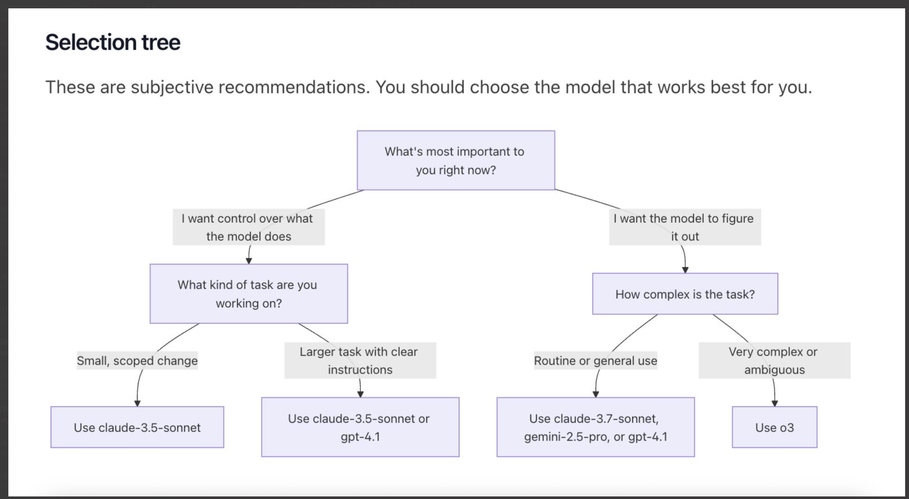

# 🚀 Lesson 02 - GitHub Copilot Tools

---

## 📝 Overview

GitHub Copilot provides developers with powerful AI-assisted coding tools designed to streamline coding, debugging, optimization, and automation tasks. These tools integrate seamlessly into various development environments, improving productivity and efficiency across multiple stages of the software development lifecycle.

---

## 🎯 Goal

Learn about the different GitHub Copilot tools, their use cases, and how to leverage them to enhance your development workflow across various environments.

---

## ⏱️ Estimated Time

45-60 minutes

---

## 👥 Participants

Everyone (Developers, QA testers, DevOps engineers, Technical Writers, and more)

---

## 🛠️ Explore Copilot Tools

Explore the different tools available within GitHub Copilot to enhance your development workflow. Below are sections highlighting each tool, including detailed descriptions, use cases, and links to dedicated labs for hands-on learning.

---

## 🔑 Accessing Copilot: The Two Main Icons

GitHub Copilot provides two main icons in your IDE to help you quickly access Copilot features and settings:

- **Top Right Copilot Icon:**
  - Located in the upper right corner of your IDE window.
  - Click this icon to open the Copilot Chat panel, start a new chat, or access Copilot settings and account information.
  - This is the primary entry point for interacting with Copilot's conversational features and managing your Copilot experience.

- **Bottom Right Copilot Icon:**
  - Found in the lower right corner of your IDE status bar.
  - Click this icon to quickly toggle Copilot on or off, view Copilot's current status, or access inline suggestions and quick settings.
  - This icon is especially useful for enabling/disabling Copilot or checking if Copilot is active in your current workspace.

---

## 1️⃣ GitHub Copilot Ask

GitHub Copilot Ask provides quick, non-intrusive answers to programming questions directly in your editor. Get instant help understanding code, solving problems, or learning concepts without modifying your codebase.

**[📄 View detailed documentation →](2.1-exploring-copilot-ask-(react).md)**

**Key Benefits:**
- Context-aware responses based on your current editor state
- Non-intrusive guidance without code modifications
- Educational support for learning new concepts

---

## 2️⃣ GitHub Copilot Edit

GitHub Copilot Edit enables you to apply precise modifications to specific files or sections within your codebase using natural language instructions. This tool excels when you need targeted changes to a well-defined set of files rather than extensive modifications across your entire project. Simply highlight the code you want to change, provide instructions like "add error handling" or "refactor using async/await," and Copilot rewrites the code for you—while always showing you the diff for review before any changes are saved.

What makes Edit mode powerful is that you maintain full control. Copilot does the work, but you get the final say. You can also enhance its effectiveness by providing custom instructions that teach Copilot your team's coding standards, style preferences, and documentation requirements.

**How to Use:**
1. **Select the code** you want to modify in your editor.
2. **Right-click** and choose **"Copilot: Edit"** or use `Ctrl+K` (Windows/Linux) or `Cmd+K` (macOS).
3. **Type your instruction** in natural language (e.g., "add error handling", "refactor using async/await").
4. **Review the diff** that Copilot presents showing the proposed changes.
5. **Accept or reject** the changes, or provide additional feedback to refine the result.

**Example use cases:**

- Making controlled changes to a specific subset of your codebase
- Refactoring code with modern patterns while preserving the rest of the system
- Implementing targeted optimizations in performance-critical sections
- Adding error handling or logging to existing implementations
- Applying consistent patterns to related files without affecting other components
- Working in brownfield applications where you need surgical precision

**Labs:**
- [Exploring GitHub Copilot Edit (React)](2.2-exploring-copilot-edit-(react).md)

---

## 3️⃣ GitHub Copilot Agent

GitHub Copilot Agent represents the most powerful mode in Copilot Chat, enabling autonomous planning and execution across your entire project. With Agent mode, you provide a high-level prompt and Copilot independently selects the right files, runs necessary tools or terminal commands, and applies code edits until the task is complete. Unlike Edit mode, Agent analyzes related code and identifies additional changes needed across the project to maintain consistency.

What distinguishes Agent mode is its ability to work autonomously—applying edits automatically rather than waiting for explicit approval at each step, while still surfacing potentially risky commands for review. This creates a continuous-edit "driver" model where you define the goal and Copilot executes updates without interruption.

For maximum effectiveness, Agent mode works best with custom instructions that define your project structure, coding standards, and other guidelines. These instructions provide a stronger foundation for Copilot to work from, resulting in more consistent and aligned outcomes across multiple sessions.

**How to Use:**
1. **Open Copilot Chat** by clicking the chat icon in your IDE or using the keyboard shortcut.
2. **Type `@workspace`** to enable Agent mode for your entire project.
3. **Provide a high-level description** of what you want to accomplish (e.g., "implement user authentication", "add error logging throughout the app").
4. **Review the plan** that Copilot presents before execution.
5. **Monitor the progress** as Copilot autonomously makes changes across multiple files.
6. **Approve any risky operations** when prompted (like running terminal commands).

**Example use cases:**

- Building complete features from high-level descriptions
- Fixing complex bugs that require changes across multiple files
- Creating new files and scaffolding entire sections of an application
- Implementing architectural changes that affect multiple components
- Setting up new projects based on README specifications or requirements documents
- Refactoring code while maintaining consistent patterns throughout the codebase

**Labs:**
- [Exploring GitHub Copilot Agent (React)](2.3-exploring-copilot-agent-(react).md)

---

## 4️⃣ GitHub Copilot Chat Modes

GitHub Copilot Chat operates in different modes, each optimized for specific use cases. You can switch between modes anytime in the Chat view to match your current development task.

### **Built-in Chat Modes**

**Ask Mode**
- **Purpose**: Optimized for answering questions about your codebase and technology concepts
- **Best for**: Understanding code, brainstorming design ideas, exploring new technologies
- **React use**: Component architecture questions, debugging help, best practices guidance

**Edit Mode** 
- **Purpose**: Making precise code edits across multiple files with full control
- **Best for**: Well-defined changes where you know exactly what needs to be modified
- **React use**: Refactoring components, updating prop interfaces, style modifications

**Agent Mode**
- **Purpose**: Autonomous edits across multiple files with intelligent decision-making
- **Best for**: Complex tasks that may require running terminal commands and tools
- **React use**: Complete feature implementation, architectural changes, setup tasks

### **Custom Chat Modes**

Create personalized chat modes tailored to your specific React development workflows using `.chatmode.md` files.

**Example Custom Modes for React:**
- **"React Review"**: Code review focused on React best practices and performance
- **"Component Plan"**: Generate implementation plans for new React components
- **"Testing Focus"**: Specialized mode for creating React testing strategies

**How to Create:**
1. Run **Chat: New Mode File** in Command Palette
2. Choose workspace or user profile location
3. Define tools, instructions, and guidelines in the `.chatmode.md` file

Learn more: [VS Code Chat Modes Documentation](https://code.visualstudio.com/docs/copilot/chat/chat-modes)

---

## 5️⃣ Workspace Context: @workspace and #codebase

GitHub Copilot provides powerful workspace-aware context through two main approaches: `@workspace` for comprehensive project analysis and `#codebase` for flexible code search integration.

**@workspace** searches through your entire VS Code workspace to find relevant context for your questions, including all indexable files, directory structure, GitHub's code search index (if available), symbols and definitions, and currently selected text.

**#codebase** performs targeted codebase searches based on your prompt and adds relevant code as context. It's more flexible than `@workspace` and can be combined with other tools for editing scenarios.

**Key Differences:**
- **@workspace**: Read-only analysis tool, works only in Ask mode, provides comprehensive project understanding
- **#codebase**: Flexible search tool, works in all chat modes (Ask, Edit, Agent), can be combined with other operations

**How to Use:**
- Use `@workspace` followed by your question: `"@workspace how is authentication implemented?"`
- Use `#codebase` in any prompt: `"add unit tests and run them #codebase"`
- Enable `github.copilot.chat.codesearch.enabled` setting for enhanced `#codebase` effectiveness

**Example use cases:**
- `"@workspace where is database connection string configured?"` - Find configuration patterns
- `"add a tooltip to this button, consistent with other buttons #codebase"` - Find and apply existing patterns
- `"@workspace how can I add a new API route for forgot password?"` - Get implementation guidance
- `"How do I build this #codebase?"` - Understand build processes from documentation and scripts

**Index Management:**
Copilot uses different indexing strategies for optimal performance:
- **Remote Index**: For GitHub repositories, automatically maintained and updated
- **Local Index**: For non-GitHub projects, built automatically for projects under 750 files
- **Basic Index**: Fallback for larger projects (2500+ files) using simpler algorithms

Learn more: [VS Code Workspace Context Documentation](https://code.visualstudio.com/docs/copilot/reference/workspace-context#_remote-index)

---

## 6️⃣ Choosing the Right AI Model

GitHub Copilot offers multiple AI models optimized for different use cases. Selecting the appropriate model can significantly impact the quality and efficiency of your development experience.

**Model Selection Strategy:**
- **Small, scoped changes**: Use **Claude-3.5-Sonnet** for targeted modifications and quick iterations
- **Larger tasks with clear instructions**: Use **Claude-3.5-Sonnet** or **GPT-4.1** for feature development and refactoring
- **Routine or general use**: Use **Claude-3.7-Sonnet**, **Gemini-2.5-Pro**, or **GPT-4.1** for everyday development assistance
- **Very complex or ambiguous tasks**: Use **o3** for advanced reasoning and complex problem-solving

**For React Development:**
- **Component creation and modification**: Claude-4-Sonnet or GPT-4.1
- **Complex state management**: Claude-3.7-Sonnet or o3 for intricate logic
- **Performance optimization**: o3 for advanced analysis and recommendations
- **Quick fixes and styling**: Claude-3.5-Sonnet or Claude-3.7-Sonnet for rapid iterations

You can switch models anytime in Copilot Chat to match your current task requirements.

---

## 7️⃣ GitHub Copilot Inline

Enhance productivity by using inline prompts directly within your editor for quick React component modifications, method generation, and incremental improvements without leaving your coding context.

**[📄 Explore Inline with React →](2.4-exploring-copilot-inline-(react).md)**

**Key Benefits:**
- **Rapid iterations** on React components and hooks
- **Context-aware suggestions** based on your current component state
- **Seamless workflow** without switching between chat and editor

---

## 8️⃣ GitHub Platform Features

GitHub Copilot extends beyond your IDE with powerful web-based and command-line features for comprehensive AI assistance across your development workflow.

**[🌐 Explore GitHub Platform Features →](2.6-github-copilot-features.md)**

**Key Features:**
- **Web Dashboard**: Manage settings, analytics, and usage insights
- **CLI Integration**: Generate and explain terminal commands
- **Code Review**: AI-assisted pull request analysis
- **PR Summaries**: Automated pull request documentation
- **Commit Messages**: Smart commit message generation

---

© Copyright Neudeisc 2025
