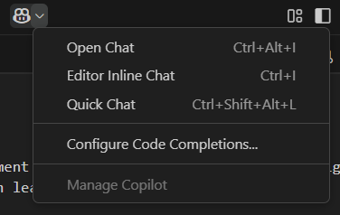
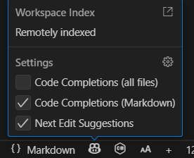

# 🚀 Lesson 02 - GitHub Copilot Tools

---

## 📝 Overview

GitHub Copilot provides developers with powerful AI-assisted coding tools designed to streamline coding, debugging, optimization, and automation tasks. These tools integrate seamlessly into various development environments, improving productivity and efficiency across multiple stages of the software development lifecycle.

---

## 🎯 Goal

Learn about the different GitHub Copilot tools, their use cases, and how to leverage them to enhance your development workflow across various environments.

---

## ⏱️ Estimated Time

45-60 minutes

---

## 👥 Participants

Everyone (Developers, QA testers, DevOps engineers, Technical Writers, and more)

---

## 🛠️ Explore Copilot Tools

Explore the different tools available within GitHub Copilot to enhance your development workflow. Below are sections highlighting each tool, including detailed descriptions, use cases, and links to dedicated labs for hands-on learning.

---

## 🔑 Accessing Copilot: The Two Main Icons

GitHub Copilot provides two main icons in your IDE to help you quickly access Copilot features and settings:

- **Top Right Copilot Icon:**
  - Located in the upper right corner of your IDE window.
  - Click this icon to open the Copilot Chat panel, start a new chat, or access Copilot settings and account information.
  - This is the primary entry point for interacting with Copilot's conversational features and managing your Copilot experience.

- **Bottom Right Copilot Icon:**
  - Found in the lower right corner of your IDE status bar.
  - Click this icon to quickly toggle Copilot on or off, view Copilot's current status, or access inline suggestions and quick settings.
  - This icon is especially useful for enabling/disabling Copilot or checking if Copilot is active in your current workspace.

---

## 1️⃣ GitHub Copilot Ask

GitHub Copilot Ask provides quick, non-intrusive answers to programming questions directly in your editor. Get instant help understanding code, solving problems, or learning concepts without modifying your codebase.

**[📄 View detailed documentation →](2.1-github-copilot-ask.md)**

**Key Benefits:**
- Context-aware responses based on your current editor state
- Non-intrusive guidance without code modifications
- Educational support for learning new concepts

---

## 2️⃣ GitHub Copilot Edit

GitHub Copilot Edit enables you to apply precise modifications to specific files or sections within your codebase using natural language instructions. This tool excels when you need targeted changes to a well-defined set of files rather than extensive modifications across your entire project. Simply highlight the code you want to change, provide instructions like "add error handling" or "refactor using async/await," and Copilot rewrites the code for you—while always showing you the diff for review before any changes are saved.

What makes Edit mode powerful is that you maintain full control. Copilot does the work, but you get the final say. You can also enhance its effectiveness by providing custom instructions that teach Copilot your team's coding standards, style preferences, and documentation requirements.

**Example use cases:**

- Making controlled changes to a specific subset of your codebase
- Refactoring code with modern patterns while preserving the rest of the system
- Implementing targeted optimizations in performance-critical sections
- Adding error handling or logging to existing implementations
- Applying consistent patterns to related files without affecting other components
- Working in brownfield applications where you need surgical precision

**Labs:**
- [Exploring GitHub Copilot Edit](labs/c-sharp-1/2.2-exploring-copilot-edit.md) (C#/.NET)
- [Exploring GitHub Copilot Edit with React](<labs/react/2.2-exploring-copilot-edit-(react).md>) (React)
- [Exploring Copilot Edit with Ecommerce](labs/c-sharp-2/2.2-exploring-copilot-edit.md) (C# Ecommerce)

---

## 3️⃣ GitHub Copilot Agent

GitHub Copilot Agent is a tool that automates complex coding tasks by understanding your project context and executing changes across multiple files. It acts like a virtual assistant, capable of making significant modifications based on inputted descriptions, such as "create a new feature" or "refactor the codebase to use async/await."

**[📄 View detailed documentation →](2.3-github-copilot-agent.md)**

**Key Benefits:**
- Automates large-scale changes across multiple files
- Understands project context to make informed decisions

---

## 4️⃣ GitHub Copilot Inline

Enhance productivity by using inline prompts directly within your editor, enabling quick code changes, method generation, and small incremental improvements without leaving the coding context. This approach is ideal for quick, iterative coding and minor adjustments that don't require extensive context switching.

_Hover over inline suggestions in your IDE to see the available options, and use the Copilot icon in the bottom right corner to access inline suggestions._

_Ctrl + I to open the inline suggestions window, where you can see and select from multiple suggestions based on your current cursor position. This allows you to quickly apply changes or generate new code snippets without interrupting your coding flow._

**Example use cases:**

- Quickly renaming methods or variables across a single file
- Generating and inserting simple code blocks or functions
- Implementing standard design patterns (e.g., Factory, Singleton, Observer)
- Writing unit tests for existing methods
- Converting between code formats (e.g., converting a for loop to LINQ in C#)
- Generating regular expressions for specific validation requirements
- Implementing interface methods or abstract class implementations
- Creating data models or DTOs based on existing patterns in your codebase

**Labs:**
- [Exploring GitHub Copilot Inline](labs/c-sharp-1/2.4-exploring-copilot-inline.md) (C#/.NET)
- [Exploring GitHub Copilot Inline with React](<labs/react/2.4-exploring-copilot-inline-(react).md>) (React)
- [Exploring Copilot Inline with Ecommerce](labs/c-sharp-2/2.4-exploring-copilot-inline.md) (C# Ecommerce)

---

## 5️⃣ GitHub Copilot Website

Utilize the Copilot Web interface to explore suggestions, manage preferences, and gain insights into your coding habits and productivity. This centralized interface provides a comprehensive dashboard for reviewing usage analytics, setting global preferences, accessing educational resources, and managing your Copilot subscription.

**Example use cases:**

- Reviewing coding suggestions outside of your IDE
- Analyzing your coding patterns to identify improvement areas
- Managing subscription details and preferences
- Customizing Copilot's behavior across different programming languages
- Setting up global ignore patterns for sensitive or proprietary code
- Accessing learning resources and official documentation
- Reviewing historical usage statistics to optimize your development workflow
- Providing feedback to the GitHub team on Copilot's suggestions

**Labs:**
- [Exploring GitHub Copilot Website](labs/c-sharp-2/2.5-exploring-copilot-website.md) (C#/.NET)

---

## 6️⃣ GitHub Copilot CLI

Streamline command-line operations by generating shell commands and automating tasks directly from your terminal. Copilot CLI transforms natural language descriptions into powerful command-line instructions, making complex operations accessible without requiring memorization of syntax or extensive documentation lookups.

**Example use cases:**

- Generating complex git commands for repository management (e.g., interactive rebasing, complex merges)
- Creating automation scripts quickly through natural language prompts
- Executing system-level operations without extensive command-line expertise
- Constructing advanced grep, sed, or awk commands for text processing
- Building deployment pipelines and CI/CD scripts
- Generating database queries or migration scripts
- Creating Docker and Kubernetes management commands
- Formulating complex data transformation pipelines using tools like jq or yq

**Labs:**
- Mastering GitHub Copilot CLI (Coming Soon)

---

## 7️⃣ GitHub Copilot Code Review

GitHub Copilot now extends its capabilities to the code review process, offering **AI-generated code review suggestions** directly within your workflow. This tool provides actionable, context-aware recommendations—such as identifying potential bugs, suggesting best practices, highlighting security vulnerabilities, and flagging style inconsistencies.

With Copilot Code Review, you get tailored suggestions for improving your code quality before merging or deploying changes. The system analyzes the code in your pull requests and surfaces comments just like a human reviewer, saving you time and helping your team maintain high standards.

**How to Use:**
When you create or view a pull request on GitHub, look for the Copilot suggestions in the “Conversation” or “Files changed” tab. You can accept, reject, or discuss Copilot’s code review comments just like any other feedback.

---

## 8️⃣ Copilot Pull Request Summaries

Copilot can now **automatically generate a summary for your pull request**, giving reviewers a clear overview of what’s changed and what to focus on. These AI-generated summaries highlight which files are impacted, the nature of the changes, and any potential areas of concern for reviewers.

This feature accelerates the review process, ensures nothing is overlooked, and reduces manual documentation efforts. Summaries appear automatically in your pull request description, making collaboration faster and more transparent.

**How to Use:**
When opening a pull request, Copilot may prompt you to generate a summary or insert one automatically. Review and edit as needed before publishing your PR.

---

## 9️⃣ Generate Commit Message inside VS Code Git

Writing meaningful commit messages is essential for project history and collaboration. With GitHub Copilot integrated into VS Code, you can now **generate commit messages directly from the Git panel**.
Copilot analyzes your staged changes and suggests clear, descriptive commit messages, saving you time and ensuring consistency.

This is especially helpful when making multiple or complex updates—Copilot will propose a concise summary based on what’s been changed, which you can accept as-is or modify as needed.

**How to Use:**
- In VS Code, stage your changes in the Source Control panel.
- In the commit message box, look for the Copilot icon or prompt.
- Click to have Copilot suggest a commit message for your changes.
- Edit if necessary, then commit as usual.

---

© Copyright Neudeisc 2025
