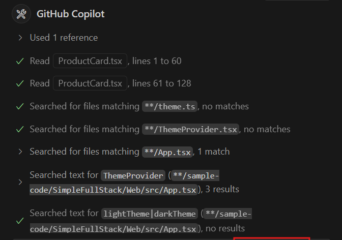
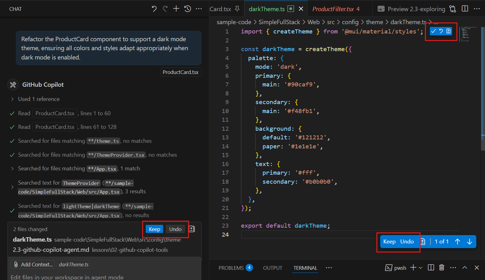
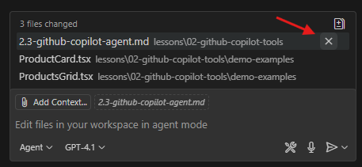
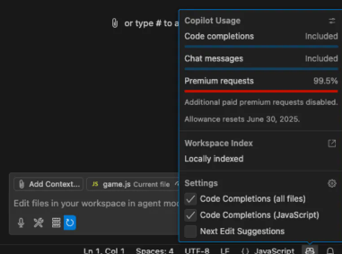

# 🚀 Getting Started with GitHub Copilot Agent

---

### 📝 Overview

GitHub Copilot Agent is the most powerful mode of GitHub Copilot, designed to autonomously plan and execute complex coding tasks across your entire project. Agent mode can analyze your codebase, select relevant files, run tools or terminal commands, and apply code edits until your high-level goal is achieved.

---

### 🎯 Goal

The goal of this lesson is to introduce you to GitHub Copilot Agent. You will learn how to use it to automate large-scale changes, build features, refactor code, and solve complex problems that span multiple files or components.

---

### ⏱️ Estimated Time

10-15 minutes

---

### 👥 Participants

Everyone (Developers, QA testers, DevOps engineers, Technical Writers, and more)

---

## What Is GitHub Copilot Agent?

GitHub Copilot Agent is an autonomous coding assistant designed to take a prompt and independently complete the users request. Unlike the Ask or Edit modes, Agent mode offers a more proactive and comprehensive approach. It can analyze your entire codebase to understand the context, select and modify multiple files as necessary, and even run terminal commands or scripts. It applies code changes automatically, though it prompts for review when actions are considered risky. Additionally, it ensures consistency and adherence to best practices throughout your project. This makes Agent mode particularly well-suited for tasks such as building new features, refactoring architecture, fixing bugs that span multiple files, or scaffolding new projects. You simply provide the goal and Copilot Agent determines the steps and carries them out.

### Key Features:

- **Autonomous Execution**: Plans and applies changes across your project
- **Project-Wide Context**: Understands dependencies and relationships between files
- **Continuous Editing**: Executes a series of edits and commands until the task is complete
- **Tailored Guidance**: Adapts to your coding conventions and project architecture for cohesive output

---

### Example Use Cases

- Building complete features from high-level descriptions
- Fixing complex bugs that require changes across multiple files
- Creating new files and scaffolding entire sections of an application
- Implementing architectural changes that affect multiple components
- Setting up new projects based on README specifications or requirements documents
- Refactoring code while maintaining consistent patterns throughout the codebase

---

## How It Works – Step by Step

Here’s how to use GitHub Copilot Agent effectively:

1. **Open the Copilot Chat Panel**
   - Click the Copilot icon in the upper right of your IDE, use the command palette, or click on the chat icon on the left to open the chat panel.
   - Ensure Agent mode is selected:

     

2. **Describe Your Goal**
   - In the chat input, type a prompt describing what you want to achieve.
   - Examples:
     - "Create a grid component for user data."
     - "Refactor all API endpoints to use async/await."
     - "Create a new feature for user profile management."

3. **Let Copilot Agent Plan and Execute**
   - Copilot Agent will analyze your project, select relevant files, and begin making changes.
   - It may run terminal commands, install dependencies, or scaffold new files as needed.

     

   - For potentially risky actions (like deleting files or running scripts), you’ll be prompted to review and approve.

4. **Review Progress and Results**
   - Watch as Copilot Agent applies edits and provides updates in the chat panel.
   - You can stop, pause, or ask follow-up questions at any time.
   - Review the final changes, you can keep or undo them as needed.

   Example of Copilot Agent making changes:
   - In this case Agent made a new file to support a simple dark mode feature.
   - You can see several keep and undo options which can be used to manage the changes made by Copilot Agent.

     

---

### Managing Files in Copilot Agent

When you use Copilot Agent, any files that are created or edited during a session will appear in a panel above the chat interface. For each file, you’ll see options to **keep** or **undo** the changes, giving you full control over what gets committed to your project.

These files are automatically added to the context for each new request you make in the chat. This means Copilot Agent will consider them when planning and executing further actions, ensuring continuity and awareness of recent changes.

> **Tip:** If a file is no longer relevant to your current task, be sure to clear it from the context panel. Keeping only the files that matter helps Copilot Agent stay focused and prevents unrelated changes from influencing your results.

---

### Integration with Other Tools

GitHub Copilot Agent is designed to work seamlessly with a variety of popular development tools and extensions, enhancing your workflow rather than replacing it. Here are some ways Copilot Agent integrates with other tools:

- **Linters and Formatters:** Copilot Agent works alongside tools like ESLint, Prettier, and Stylelint. After Agent makes changes, your linter or formatter can automatically enforce your project's code style and standards.
- **Testing Frameworks:** Use Copilot Agent to generate or refactor code, then run your existing test suites (e.g., Jest, Mocha, PyTest, JUnit) to validate changes. Agent can also help scaffold new tests or update existing ones.
- **Version Control:** All changes made by Copilot Agent are visible in your version control system (e.g., Git). You can review, stage, and commit these changes as you would with any other edits. The GitHub Pull Requests and Issues extension can be used to review and discuss Agent-generated changes with your team.
- **CI/CD Pipelines:** Copilot Agent’s edits are compatible with CI/CD tools like GitHub Actions, Azure Pipelines, and Jenkins. Automated builds and tests will run as usual, helping you catch issues early.
- **Project Management:** Integrate with tools like GitHub Projects or Jira (via extensions) to track tasks and progress. You can use Copilot Agent to help automate repetitive project management tasks, such as updating documentation or generating changelogs.

> **Tip:** For best results, always review Copilot Agent’s changes in the context of your team’s code review and CI/CD processes. This ensures that automated edits align with your project’s standards and workflows.

---

### Model Access and Usage Limits

GitHub Copilot provides access to different AI models through a tiered system. The GPT-4.1 model is available as a base model that you can use without any usage limits. This means you can take advantage of its advanced capabilities for as many tasks as you need.

GitHub Copilot's tiered model system includes premium models (like GPT-4 and Claude 3.5 Sonnet) that offer enhanced capabilities for complex tasks. All premium models have a multiplier applied to usage counting, and each user has a monthly limit of requests. This means that when you use models other than GPT-4.1, your usage is calculated with a multiplier factor that counts against your monthly allowance.

To monitor your usage and any applicable monthly limits for premium models, click the Copilot icon in the bottom right corner of your IDE. A usage panel will appear, showing your current usage and remaining quota for the month. This helps you keep track of your access and plan your work accordingly.

---

### 🚨 Common Mistakes to Avoid:

1. **Vague Prompts**: Be as specific as possible about your goal
2. **Not Reviewing Risky Actions**: Always review and approve potentially destructive commands
4. **Ignoring Project Standards**: Provide custom instructions for best results
    - Example: If your project uses specific naming conventions (like PascalCase for components), tell Copilot Agent: "Follow our PascalCase naming convention for all React components and use TypeScript interfaces for props."
5. **Not Reviewing Provided Changes**: Always review and test the changes made by Copilot Agent to ensure they meet your expectations and project standards.

---

### Troubleshooting, Limitations & Known Issues

- If Copilot Agent is not responding, try restarting your IDE or checking your internet connection.
- Edits may not apply if you have unsaved changes or if there are file permission issues.
- Copilot Agent currently works best with popular languages and frameworks; support for less common stacks may be limited.
- Large files or very large projects may impact performance or context awareness.
- Some actions (like resolving merge conflicts or handling binary files) may require manual intervention.
- For additional help, consult the official documentation or reach out to GitHub support.

---

## 🧪 Labs

Complete the hands-on exercises to master GitHub Copilot Agent:

- [Exploring GitHub Copilot Agent](labs/c-sharp-1/2.3-exploring-copilot-agent.md) (C#/.NET)
- [Exploring GitHub Copilot Agent with React](<labs/react/2.3-exploring-copilot-agent-(react).md>) (React)
- [Exploring Copilot Agent with Ecommerce](labs/c-sharp-2/2.3-exploring-copilot-agent.md) (C# Ecommerce)

---

© Copyright Neudeisc 2025
