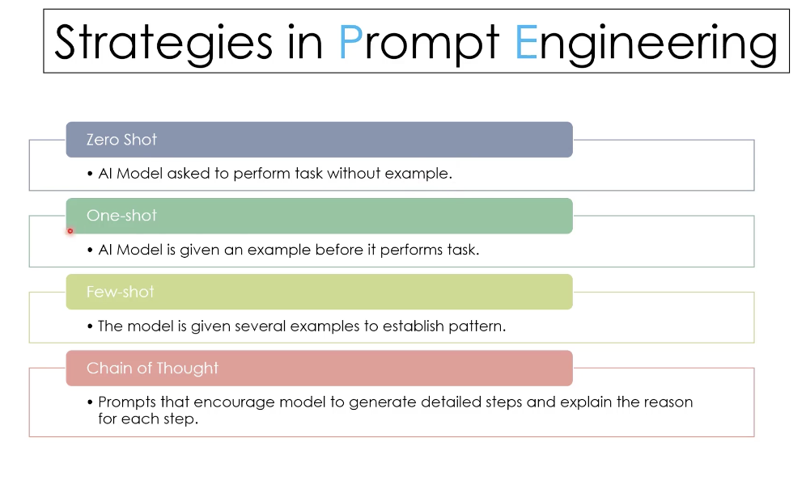

# 🎯 Lesson 3.3: Advanced Prompt Engineering for GitHub Copilot

## Overview

**Goal:**  
Master prompt engineering techniques to maximize GitHub Copilot's effectiveness across development scenarios, from basic code completion to complex problem-solving using the latest official best practices.

**Estimated Duration:** 30-35 minutes

**Audience:**  
Developers at all levels who want to write effective prompts for GitHub Copilot code completion and Copilot Chat

**Prerequisites:**
- GitHub Copilot installed and activated
- Basic understanding of GitHub Copilot functionality
- Familiarity with your development environment

**Official Resources:**
- [GitHub Copilot Documentation](https://docs.github.com/en/copilot/using-github-copilot/getting-code-suggestions-in-your-ide-with-github-copilot)
- [How to write better prompts for GitHub Copilot](https://github.blog/developer-skills/github/how-to-write-better-prompts-for-github-copilot/)

---

## 🧠 Strategies in Prompt Engineering

Effective prompt engineering follows established patterns that guide AI models to produce better results:



### **Zero Shot**
- AI Model asked to perform task without examples
- **When to use**: Simple, well-defined tasks that don't require specific formatting
- **Example**: "Create a function that calculates the area of a circle"

### **One-shot**
- AI Model is given an example before it performs task
- **When to use**: When you want to establish a specific pattern or format
- **Example**: "Here's how to format a commit message: `feat(auth): add login validation`. Now write one for adding a new user profile feature."

### **Few-shot**
- The model is given several examples to establish pattern
- **When to use**: Complex tasks requiring consistent structure or multiple variations
- **Example**: Provide 3-4 examples of API endpoint documentation before asking for a new one

### **Chain of Thought**
- Prompts that encourage model to generate detailed steps and explain the reason for each step
- **When to use**: Complex problem-solving, debugging, or when you need to understand the reasoning
- **Example**: "Debug this authentication issue step by step. First, check if the JWT token is valid, then verify the user permissions, then..."

---

## 🎯 Understanding Prompts and Context

### What is a Prompt?

According to the [official GitHub documentation](https://docs.github.com/en/copilot/using-github-copilot/prompt-engineering-for-github-copilot), a prompt is:

> **A request that you make to GitHub Copilot** - such as a question in Copilot Chat, or a code snippet that you ask Copilot to complete.

### Two Types of Prompting

| **Code Completion Prompts** | **Copilot Chat Prompts** |
|----------------------------|---------------------------|
| **Comments and code context** in your editor | **Natural language questions** in chat interface |
| Triggers automatic suggestions | Requires explicit user input |
| Uses surrounding code for context | Uses chat history and referenced files |
| Best for: Implementation details | Best for: Planning, debugging, explanations |

### How Context Works

GitHub Copilot uses multiple context sources:
- **Open files** in your IDE (neighboring tabs)
- **Current file** content and cursor position  
- **Chat history** (for Copilot Chat)
- **Custom instructions** from `.copilot-instructions.md`
- **Referenced code** using `@` mentions and file selections

---

## 📚 Core Prompt Engineering Principles

Based on the [official GitHub Copilot best practices](https://github.blog/developer-skills/github/how-to-write-better-prompts-for-github-copilot/), here are the foundational techniques:

### 1. **Start General, Then Get Specific**

Begin with a broad description, then add specific requirements:

```text
// ❌ Too vague
// Write some code for user authentication

// ✅ Good structure
// Create a user authentication system for a Node.js app
// - Use Express and JWT tokens
// - Include password hashing with bcrypt  
// - Add rate limiting for login attempts
// - Return proper error messages for invalid credentials
```

### 2. **Provide Clear Examples**

Examples help Copilot understand exactly what you want:

```javascript
// ✅ Excellent prompt with examples
// Write a function that finds all dates in a string and returns them in an array
// Dates can be formatted like:
// - 05/02/24, 05/02/2024, 5/2/24, 5/2/2024
// - 05-02-24, 05-02-2024, 5-2-24, 5-2-2024
//
// Example:
// findDates("I have a dentist appointment on 11/14/2023 and book club on 12-1-23")
// Returns: ["11/14/2023", "12-1-23"]

function findDates(text) {
  // Copilot will generate accurate regex and logic based on examples
}
```

### 3. **Break Complex Tasks into Simple Steps**

Instead of asking for everything at once, decompose the problem:

```text
// ❌ Too complex
"Create a complete word search puzzle generator with solutions"

// ✅ Step-by-step approach
// Step 1: Write a function to generate a 10x10 grid of random letters
// Step 2: Write a function to place words horizontally in the grid
// Step 3: Write a function to place words vertically in the grid  
// Step 4: Write a function to find all words in a completed grid
// Step 5: Combine everything into a puzzle generator
```

### 4. **Use Good Coding Practices**

Following best practices improves AI suggestions:

```javascript
// ✅ Descriptive naming and clear patterns
function authenticateUser(username, password) {
  // Copilot generates relevant, well-structured code
}

// ❌ Poor naming confuses AI
function rndpwd(l) {
  // Copilot responds with: "Code goes here"
}
```

---

## 🗣️ Copilot Chat Advanced Techniques

### Avoid Ambiguity

Be specific about what you're referencing:

```text
// ❌ Ambiguous
"What does this do?"

// ✅ Specific  
"What does the createUser function do?"
"What does the code in your last response do?"
"Explain the authentication logic in the selected code"
```

### Reference Relevant Code

Use IDE features to provide context:

```text
// In VS Code: Use @workspace, #file references
@workspace How can I optimize the database queries in this project?

// In JetBrains: Use @project
@project What design patterns are used in the authentication module?

// Reference specific files
How can I improve the error handling in #src/utils/api.js?
```

### Use Chat Participants and Context

GitHub Copilot Chat supports various participants:

| Participant | Purpose | Example Usage |
|-------------|---------|---------------|
| `@workspace` | Analyze entire workspace | `@workspace Find all TODO comments` |
| `@vscode` | VS Code specific tasks | `@vscode How do I set up a debug configuration?` |
| `@terminal` | Terminal and CLI help | `@terminal Help me with git rebase commands` |

### Keep Chat History Relevant

Manage your conversation context:

```text
// ✅ Good practices
- Start new threads for different tasks
- Delete irrelevant or failed responses  
- Reference previous responses when building on them
- Clear history when switching contexts

// Example of building on previous responses
"Enhance the authentication function from your last response to include 2FA"
```

---

## 🛠️ Code Completion Best Practices

### Optimize Your Development Environment

Based on [official documentation](https://docs.github.com/en/copilot/using-github-copilot/getting-code-suggestions-in-your-ide-with-github-copilot), here's how to get better suggestions:

#### File Management

```text
✅ Do:
- Keep 1-2 relevant files open (neighboring tabs)
- Close unrelated files that might confuse context
- Open files that contain patterns you want to follow

❌ Avoid:
- Having too many unrelated files open
- Working in files without relevant context
- Keeping outdated implementations open
```

#### Comment-Driven Development

Use descriptive comments to guide AI suggestions:

```javascript
// ✅ Excellent comment-driven approach
/*
Create a React component for user profile editing with:
- Form validation using Yup schema
- Auto-save on field changes
- Loading states during API calls  
- Error handling with toast notifications
- Responsive design for mobile devices
*/

function UserProfileEditor() {
  // Copilot generates structured component with all requirements
}
```

#### Progressive Implementation

Let AI build complexity gradually:

```javascript
// Step 1: Basic structure
function calculateShippingCost(weight, distance) {
  // Base calculation
}

// Step 2: Add validation  
function calculateShippingCost(weight, distance) {
  if (weight <= 0 || distance <= 0) {
    throw new Error('Invalid input parameters');
  }
  // Copilot continues with validated logic
}

// Step 3: Add premium features
function calculateShippingCost(weight, distance, options = {}) {
  // Previous validation code
  
  // Add express shipping, insurance, etc.
  const { express = false, insurance = false } = options;
  // Copilot builds on existing pattern
}
```

---

## 💡 Practical Prompt Examples

### Real-World Code Completion Scenarios

Based on the [GitHub blog examples](https://github.blog/developer-skills/github/how-to-write-better-prompts-for-github-copilot/), here are proven patterns:

#### Building a Markdown Editor

```javascript
/*
Create a basic markdown editor in Next.js with the following features:
- Use react hooks
- Create state for markdown with default text "type markdown here"
- A text area where users can write markdown
- Show a live preview of the markdown text as I type
- Support for basic markdown syntax like headers, bold, italics
- Use React markdown npm package
- The markdown text and resulting HTML should be saved in the component's state and updated in real time
*/

export default function MarkdownEditor() {
  // Copilot generates complete functional component
}
```

#### Step-by-Step Text Processing

```javascript
// Reverse a sentence step by step (proven example from GitHub blog)

// Step 1: Make the first letter lowercase if it's not an 'I'
function processFirstLetter(sentence) {
  // Copilot suggestion
}

// Step 2: Split the sentence into an array of words
function splitIntoWords(sentence) {
  // Copilot suggestion
}

// Step 3: Remove punctuation marks
function removePunctuation(words) {
  // Copilot suggestion
}

// Step 4: Reverse the word order
function reverseWords(words) {
  // Copilot suggestion
}

// Step 5: Capitalize first letter and add punctuation
function finalizeReversedSentence(words) {
  // Copilot suggestion
}
```

#### Array Processing with Examples

```javascript
// Extract names from nested arrays (proven GitHub blog example)
// Example: Extract names from the data array
// Desired outcome: ['John', 'Jane', 'Bob']
const data = [
  [{ name: 'John', age: 25 }, { name: 'Jane', age: 30 }],
  [{ name: 'Bob', age: 40 }]
];

// Copilot will generate: data.flatMap(sublist => sublist.map(person => person.name))
```

---

## 🎯 Advanced Chat Prompting Techniques

### Iterative Prompt Refinement

Experiment and iterate when results aren't perfect:

```text
// ❌ First attempt (too vague)
# Write some code for grades.py

// ⚠️ Second attempt (better but unclear)  
# Implement a function in grades.py to calculate the average grade

// ✅ Final attempt (specific and clear)
# Implement the function calculate_average_grade in grades.py that takes a list of grades as input and returns the average grade as a floating-point number
```

### Using Unit Tests as Examples

Write tests first to guide implementation:

```javascript
// First, describe what you want with tests
describe('isPrime function', () => {
  test('should return true for prime numbers', () => {
    expect(isPrime(2)).toBe(true);
    expect(isPrime(3)).toBe(true);
    expect(isPrime(17)).toBe(true);
  });
  
  test('should return false for non-prime numbers', () => {
    expect(isPrime(1)).toBe(false);
    expect(isPrime(4)).toBe(false);
    expect(isPrime(15)).toBe(false);
  });
  
  test('should throw error for invalid input', () => {
    expect(() => isPrime(-1)).toThrow();
    expect(() => isPrime(1.5)).toThrow();
  });
});

// Then ask Copilot to implement the function based on these tests
function isPrime(num) {
  // Copilot generates implementation that passes all tests
}
```

### Complex Problem Decomposition

Break large tasks into manageable pieces:

```text
// Instead of: "Create a complete e-commerce shopping cart"
// Use this step-by-step approach:

// Step 1: Basic cart structure
"Create a shopping cart object that can store items with id, name, price, and quantity"

// Step 2: Add cart operations  
"Add methods to add items, remove items, and update quantities in the cart"

// Step 3: Calculations
"Add methods to calculate item totals, tax, and final cart total"

// Step 4: Persistence
"Add localStorage persistence to save and restore cart state"

// Step 5: Integration
"Add React hooks to integrate the cart with a React component"
```

---

## 🧪 Hands-On Practice Exercises

### Exercise 1: Progressive Prompting

Practice the step-by-step approach with a real example:

**Task:** Build a password strength validator

```javascript
// Step 1: Basic structure
// Create a function that checks if a password meets basic requirements:
// - At least 8 characters long
// - Contains at least one uppercase letter
// - Contains at least one lowercase letter  
// - Contains at least one number

function validatePassword(password) {
  // Let Copilot implement basic validation
}

// Step 2: Add advanced requirements
// Enhance the function to also check for:
// - At least one special character (!@#$%^&*)
// - No common passwords (password, 123456, etc.)
// - No repeated characters more than 3 times

// Step 3: Return detailed feedback
// Return an object with:
// - isValid: boolean
// - score: 1-100
// - suggestions: array of improvement tips
// - estimatedCrackTime: string
```

### Exercise 2: Example-Driven Development

Use the proven examples approach:

```javascript
// Create a function that formats phone numbers
// Examples of inputs and expected outputs:
// formatPhoneNumber("1234567890") → "(123) 456-7890"
// formatPhoneNumber("123-456-7890") → "(123) 456-7890"  
// formatPhoneNumber("+1 123 456 7890") → "(123) 456-7890"
// formatPhoneNumber("123.456.7890") → "(123) 456-7890"
// 
// Should handle invalid inputs by returning null:
// formatPhoneNumber("123") → null
// formatPhoneNumber("abc") → null

function formatPhoneNumber(input) {
  // Copilot will generate robust formatting logic
}
```

### Exercise 3: Chat-Based Problem Solving

Practice using Copilot Chat for complex scenarios:

```text
@workspace I need to optimize the performance of our React app. 

Current issues:
- Initial page load takes 8 seconds
- Bundle size is 2.5MB
- Lighthouse performance score is 23/100

Analyze the codebase and suggest specific optimizations:
1. Code splitting opportunities
2. Unused dependency removal  
3. Image optimization needs
4. Bundle analysis insights

Provide actionable steps with expected impact estimates.
```

---

## ⚡ Quick Reference Guide

### Do's and Don'ts Summary

| ✅ **DO** | ❌ **DON'T** |
|-----------|--------------|
| Start general, then get specific | Use vague, ambiguous language |
| Provide clear examples | Assume Copilot knows your context |
| Break complex tasks into steps | Ask for everything at once |
| Use descriptive naming | Use poor coding practices |
| Keep relevant files open | Have too many unrelated files open |
| Iterate and refine prompts | Give up after first attempt |
| Reference specific files/code | Use unclear references |
| Experiment with different approaches | Stick to one prompt style |

### Essential Prompt Starters

```text
Code Completion:
// Create a function that [specific goal]
// Requirements: [list specific needs]
// Example usage: [show expected input/output]

Copilot Chat:
@workspace How can I [specific task] in this project?
Explain the [specific code/concept] in the selected code
Generate unit tests for the [specific function/component]
What are the security implications of [specific code pattern]?
Optimize this code for [specific performance criteria]
```

---

---

## 🎯 Key Takeaways

Effective prompt engineering for GitHub Copilot is based on proven techniques from [official GitHub resources](https://docs.github.com/en/copilot/using-github-copilot/prompt-engineering-for-github-copilot):

### **The Foundation:**
- **Start general, then get specific** - provide context before details
- **Use clear examples** - show exactly what you want
- **Break complex tasks down** - one step at a time
- **Follow good coding practices** - descriptive names and clear patterns

### **For Code Completion:**
- Use descriptive comments to guide suggestions
- Keep relevant files open (1-2 neighboring tabs)
- Let AI build complexity progressively
- Iterate on naming and structure

### **For Copilot Chat:**
- Avoid ambiguous references ("this", "that")  
- Use `@workspace`, `@vscode`, and file references
- Keep chat history relevant and focused
- Experiment and refine your prompts

### **Quality Indicators:**
- ✅ Generated code compiles and follows your patterns
- ✅ Includes proper error handling and edge cases
- ✅ Integrates well with existing codebase
- ❌ Generic code that ignores your context
- ❌ Missing security or performance considerations

### **Remember:**
Just like pair programming with a human, **communication is key**. The more clearly you express your intent and provide relevant context, the better GitHub Copilot can assist you in writing production-ready code.

**Resources for Continued Learning:**

**GitHub Copilot Specific:**
- [GitHub Copilot Chat Cookbook](https://docs.github.com/en/copilot/copilot-chat-cookbook) - Specific prompt examples
- [Using GitHub Copilot in your IDE](https://github.blog/developer-skills/github/using-github-copilot-in-your-ide-tips-tricks-and-best-practices/) - Practical tips and workflows

**Advanced Prompt Engineering (Multi-Model):**
- [Anthropic Claude Prompt Engineering Guide](https://docs.anthropic.com/en/docs/build-with-claude/prompt-engineering/overview) - Comprehensive guide covering chain-of-thought, XML tags, and advanced techniques
- [OpenAI GPT-4.1 Prompting Guide](https://cookbook.openai.com/examples/gpt4-1_prompting_guide) - Latest best practices for agentic workflows, tool calling, and instruction following
- [Google Gemini Workspace Prompting Guide](https://services.google.com/fh/files/misc/gemini-for-google-workspace-prompting-guide-101.pdf) - Enterprise-focused prompting strategies for productivity tools

---

**Next:** Continue exploring advanced GitHub Copilot features and enterprise integration strategies

---

© Copyright Neudeisc 2025 