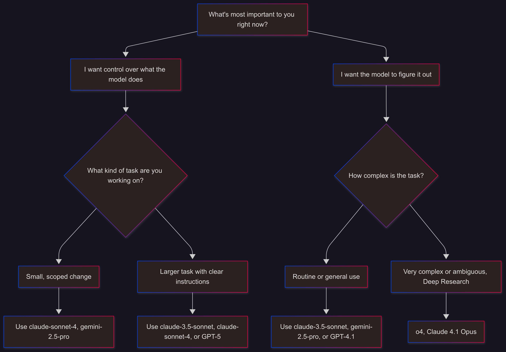

# 🎯 Lesson 3.4 - AI Model Selection Strategy

---

## 📝 Overview

GitHub Copilot offers multiple AI models optimized for different use cases. Selecting the appropriate model can significantly impact the quality and efficiency of your development experience across various programming languages and frameworks.

---

## 🎯 Goal

Learn how to choose the right AI model for different development tasks to maximize productivity and code quality.

---

## ⏱️ Estimated Time

15-20 minutes

---

## 👥 Participants

All developers working with GitHub Copilot across different languages and frameworks

---

## 🤖 Choosing the Right AI Model

GitHub Copilot offers multiple AI models optimized for different use cases. Selecting the appropriate model can significantly impact the quality and efficiency of your development experience.

**Model Selection Strategy:**
- **Small, scoped changes**: Use **Claude-3.5-Sonnet** for targeted modifications and quick iterations
- **Larger tasks with clear instructions**: Use **Claude-3.5-Sonnet** or **GPT-4.1** for feature development and refactoring
- **Routine or general use**: Use **Claude-3.7-Sonnet**, **Gemini-2.5-Pro**, or **GPT-4.1** for everyday development assistance
- **Very complex or ambiguous tasks**: Use **o3** for advanced reasoning and complex problem-solving

---

## 🛠️ Framework-Specific Recommendations

### **For React Development:**
- **Component creation and modification**: Claude-3.5-Sonnet or GPT-4.1
- **Complex state management**: Claude-3.7-Sonnet or o3 for intricate logic
- **Performance optimization**: o3 for advanced analysis and recommendations
- **Quick fixes and styling**: Claude-3.5-Sonnet or Claude-3.7-Sonnet for rapid iterations

### **For .NET/C# Development:**
- **API development**: Claude-3.5-Sonnet or GPT-4.1 for controller and service implementation
- **Entity Framework operations**: Claude-3.7-Sonnet for complex queries and migrations
- **Architecture decisions**: o3 for design patterns and architectural guidance
- **Unit testing**: Claude-3.5-Sonnet for test generation and coverage

### **For Python Development:**
- **Data analysis and ML**: o3 for complex algorithms and model optimization
- **Web frameworks (Django/Flask)**: Claude-3.5-Sonnet or GPT-4.1
- **Script automation**: Claude-3.7-Sonnet for general scripting tasks
- **API integration**: Claude-3.5-Sonnet for quick API implementations

### **For JavaScript/TypeScript:**
- **Node.js backend**: Claude-3.5-Sonnet or GPT-4.1
- **Complex type definitions**: o3 for advanced TypeScript patterns
- **Build tooling**: Claude-3.7-Sonnet for configuration and setup
- **Testing frameworks**: Claude-3.5-Sonnet for test implementation

---

## 🔄 When to Switch Models

**During Development:**
- Start with **Claude-3.5-Sonnet** for most tasks
- Switch to **o3** when encountering complex logic or architectural decisions
- Use **GPT-4.1** for tasks requiring extensive context understanding
- Try **Claude-3.7-Sonnet** or **Gemini-2.5-Pro** for routine code generation

**Based on Task Complexity:**
- **Simple tasks**: Claude-3.5-Sonnet, Claude-3.7-Sonnet
- **Medium complexity**: GPT-4.1, Gemini-2.5-Pro
- **High complexity**: o3

**Based on Response Quality:**
- If responses are too generic, try **o3** for more sophisticated analysis
- If responses are too complex, switch to **Claude-3.5-Sonnet** for simpler solutions
- If context understanding is poor, try **GPT-4.1**

---

## 💡 Best Practices

### **Model Selection Tips:**
1. **Start with the fastest model** (Claude-3.5-Sonnet) for initial iterations
2. **Escalate to more powerful models** (o3) for complex problems
3. **Consider response time** vs. quality trade-offs for your workflow
4. **Experiment with different models** for the same task to find your preference

### **Task-Model Matching:**
- **Code review and analysis**: o3 for comprehensive insights
- **Quick fixes and small changes**: Claude-3.5-Sonnet for speed
- **Documentation writing**: GPT-4.1 for natural language clarity
- **Debugging complex issues**: o3 for deep problem analysis

### **Performance Considerations:**
- **Faster models** for iterative development cycles
- **More powerful models** for critical code that needs high quality
- **Balance speed vs. accuracy** based on project deadlines

---

## 🎯 Key Takeaways

- **No single model is best for everything** - match the model to the task
- **You can switch models anytime** in Copilot Chat to match your current needs
- **Experiment with different models** to understand their strengths
- **Consider both speed and quality** when selecting models for your workflow
- **Use more powerful models for complex decisions** and simpler models for routine tasks

---

© Copyright Neudeisc 2025 