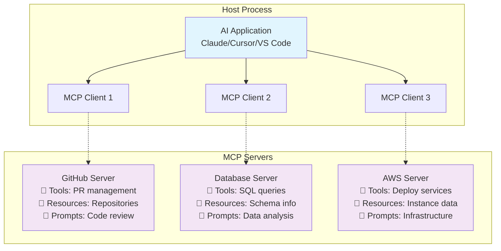

# 🧠 Lesson 4.1: Understanding Model Context Protocol (MCP)

---

## 📝 Overview

**Goal:**  
Gain a comprehensive understanding of Model Context Protocol (MCP), its revolutionary approach to AI tool integration, and why it represents the future of enterprise AI workflows.

**Estimated Duration:** 15-20 minutes

**Audience:**  
Enterprise developers, solution architects, AI engineers, and technical leaders evaluating next-generation AI integration strategies.

---

## 🎯 Learning Objectives

By the end of this lesson, you will:

1. **Understand the core concepts** of Model Context Protocol and its architecture
2. **Recognize the enterprise benefits** and strategic advantages of MCP
3. **Compare MCP with traditional approaches** to AI tool integration
4. **Identify use cases** where MCP provides significant value
5. **Prepare for hands-on implementation** in the next lesson

---

## 🌐 What is Model Context Protocol (MCP)?

### **The Official Definition**
> *"The Model Context Protocol (MCP) is an open protocol that enables seamless integration between LLM applications and external data sources and tools. Whether you're building an AI-powered IDE, enhancing a chat interface, or creating custom AI workflows, MCP provides a standardized way to connect LLMs with the context they need."*

### **In Simple Terms**
MCP is like **USB for AI tools** - a universal standard that allows any AI application to connect to any data source or service without custom integration code.

---

## 🏗️ MCP Architecture: The Three-Layer Model

### **1. Host Process (AI Application)**
- **Your primary AI application** (Claude Desktop, Cursor, VS Code with Copilot)
- **Launches language models** and manages user interactions
- **Orchestrates MCP clients** and combines results
- **Handles security** and user permissions

### **2. MCP Clients (Connectors)**
- **Run inside the host application** - one per external service
- **Handle protocol communication** (JSON-RPC over stdio or HTTP)
- **Provide isolation** between different services
- **Translate between AI and external services**

### **3. MCP Servers (Capability Providers)**
- **External tools and services** the AI can use
- **Offer three types of capabilities:**
  - **Resources:** Data you can access (files, databases, documents)
  - **Tools:** Functions you can execute (API calls, computations)
  - **Prompts:** Pre-defined instructions for specific tasks



---

## 🔄 How MCP Works: The Request Flow

### **Step 1: Discovery**
```json
{
  "jsonrpc": "2.0",
  "method": "tools/list",
  "id": 1
}
```

**AI Application asks:** "What can you do?"

### **Step 2: Schema Response**
```json
{
  "jsonrpc": "2.0",
  "id": 1,
  "result": {
    "tools": [
      {
        "name": "create_pull_request",
        "description": "Create a new pull request",
        "inputSchema": {
          "type": "object",
          "properties": {
            "title": {"type": "string"},
            "body": {"type": "string"},
            "base": {"type": "string"},
            "head": {"type": "string"}
          }
        }
      }
    ]
  }
}
```

**MCP Server responds:** "I can create pull requests with these parameters..."

### **Step 3: Tool Execution**
```json
{
  "jsonrpc": "2.0",
  "method": "tools/call",
  "id": 2,
  "params": {
    "name": "create_pull_request",
    "arguments": {
      "title": "Fix authentication bug",
      "body": "Resolves issue with JWT token validation",
      "base": "main",
      "head": "fix/auth-bug"
    }
  }
}
```

**AI Application requests:** "Create this pull request for me..."

### **Step 4: Result**
```json
{
  "jsonrpc": "2.0",
  "id": 2,
  "result": {
    "content": [
      {
        "type": "text",
        "text": "Pull request created successfully: #1234"
      }
    ]
  }
}
```

**MCP Server responds:** "Done! Here's what happened..."

---

## 🆚 MCP vs Traditional API Integration

### **Traditional Approach**
```typescript
// Custom integration for each service
class GitHubIntegration {
  constructor(token: string) {
    this.client = new Octokit({ auth: token });
  }
  
  async createPR(title: string, body: string) {
    // Custom GitHub API logic
    const response = await this.client.rest.pulls.create({
      owner: "...",
      repo: "...",
      title,
      body,
      // ... many more parameters
    });
    return this.formatResponse(response);
  }
  
  private formatResponse(response: any) {
    // Custom response formatting
    return {
      success: true,
      prNumber: response.data.number,
      url: response.data.html_url
    };
  }
}

// Repeat for every service (AWS, Database, etc.)
class AWSIntegration { /* ... */ }
class DatabaseIntegration { /* ... */ }
```

### **MCP Approach**
```typescript
// Universal MCP client
const mcpClient = new MCPClient();

// AI can use any MCP server with zero custom code
const result = await mcpClient.callTool("github", "create_pull_request", {
  title: "Fix authentication bug",
  body: "Resolves issue with JWT token validation",
  base: "main",
  head: "fix/auth-bug"
});

// The AI gets standardized responses from all services
console.log(result.content[0].text); // "Pull request created successfully: #1234"
```

---

## 🏢 Enterprise Benefits of MCP

### **🚀 Rapid Development**
- **Zero custom integration code** for supported services
- **Instant AI capabilities** for new data sources
- **Pre-built servers** for popular enterprise tools
- **Faster time-to-market** for AI features

### **🔧 Standardization**
- **Single protocol** for all AI integrations
- **Consistent error handling** across services
- **Unified authentication** patterns
- **Standardized debugging** and monitoring

### **🔒 Security & Compliance**
- **Fine-grained permissions** per MCP server
- **Isolated execution** prevents cross-service access
- **Audit trails** for all AI-driven actions
- **Enterprise-grade security** patterns

### **📈 Scalability**
- **Easy addition** of new capabilities
- **Team-wide consistency** in AI tool usage
- **Future-proof architecture** as new services emerge
- **Reduced maintenance overhead**

### **💰 Cost Efficiency**
- **No custom API wrapper development**
- **Reduced integration maintenance**
- **Shared MCP servers** across teams
- **Lower technical debt**

---

## 🎯 Real-World Enterprise Use Cases

### **Development & DevOps**
```bash
User: "Deploy the authentication service to staging and create a PR to merge the latest security patches"

AI via MCP:
1. AWS MCP → Deploy to staging environment
2. GitHub MCP → Create pull request with security patches
3. Slack MCP → Notify security team of deployment
4. Jira MCP → Update related tickets
```

### **Business Intelligence**
```bash
User: "Show me sales performance for Q4 and create a dashboard showing the top trends"

AI via MCP:
1. Database MCP → Query sales data for Q4
2. Analytics MCP → Calculate trend analysis
3. Tableau MCP → Generate interactive dashboard
4. Email MCP → Send report to stakeholders
```

### **Customer Support**
```bash
User: "A customer reported a bug with feature X. Investigate and create a support ticket"

AI via MCP:
1. Logs MCP → Search application logs for errors
2. GitHub MCP → Check recent code changes
3. Zendesk MCP → Create support ticket
4. Monitoring MCP → Set up alerts for similar issues
```

---

## 🌟 The MCP Ecosystem

### **Official Servers (Maintained by Anthropic/Partners)**
- **GitHub** - Repository management, PR automation, issue tracking
- **AWS** - Cloud resource management and deployment
- **Google Drive** - Document access and collaboration
- **Slack** - Team communication and notifications
- **PostgreSQL** - Database queries and schema inspection

### **Community Servers (700+ Available)**
- **Databases:** MySQL, MongoDB, Redis, ClickHouse
- **Cloud Platforms:** Azure, GCP, DigitalOcean
- **Development Tools:** Docker, Kubernetes, Jenkins
- **Business Apps:** Salesforce, HubSpot, Notion
- **AI/ML Platforms:** OpenAI, Hugging Face, LangChain

### **Enterprise Custom Servers**
- **Internal APIs** and microservices
- **Legacy system integrations**
- **Custom business logic**
- **Proprietary data sources**

---

## 🔮 The Future of MCP

### **Current State (2024-2025)**
- **700+ community servers** available
- **Major AI platforms adopting** MCP support
- **Enterprise-grade security** features
- **Streaming and real-time** capabilities

### **Coming Soon**
- **Agent-to-agent communication** for complex workflows
- **Multi-server transactions** with rollback support
- **Enhanced security** with capability-based permissions
- **Performance optimizations** for high-scale deployments

### **Long-term Vision**
- **Universal AI integration standard** across all platforms
- **Marketplace of AI capabilities** for easy discovery
- **Self-describing services** with automatic setup
- **AI-native enterprise architecture**

---

## 🎓 Key Takeaways

### **What Makes MCP Revolutionary**
1. **Standardization:** One protocol for all AI integrations
2. **Simplicity:** No custom code needed for supported services
3. **Security:** Built-in isolation and permission management
4. **Scalability:** Easy addition of new capabilities
5. **Future-proof:** Open standard with growing ecosystem

### **When to Use MCP**
✅ **Building AI-powered applications** that need external data  
✅ **Integrating multiple services** into AI workflows  
✅ **Enterprise environments** requiring standardization  
✅ **Teams wanting rapid development** of AI features  
✅ **Organizations planning long-term** AI strategies  

### **When to Consider Alternatives**
❌ **Simple, single-API integrations** with no AI component  
❌ **Legacy systems** that can't support modern protocols  
❌ **High-performance applications** where JSON-RPC overhead matters  
❌ **Environments with strict** network restrictions  

---

## 🏃‍♀️ Ready for Hands-On Practice?

Now that you understand the fundamentals of MCP, it's time to experience its power firsthand. In the next lesson, we'll:

1. **Install GitHub's official MCP server**
2. **Connect it to Claude Desktop or your preferred AI application**
3. **Automate pull request workflows** with natural language commands
4. **Experience the difference** between traditional APIs and MCP

The future of AI tool integration is here, and it's called MCP. Let's build something amazing together!

---

**Next:** [4.2 Hands-On Lab: GitHub MCP Server →](./4.2-github-mcp-lab.md) 