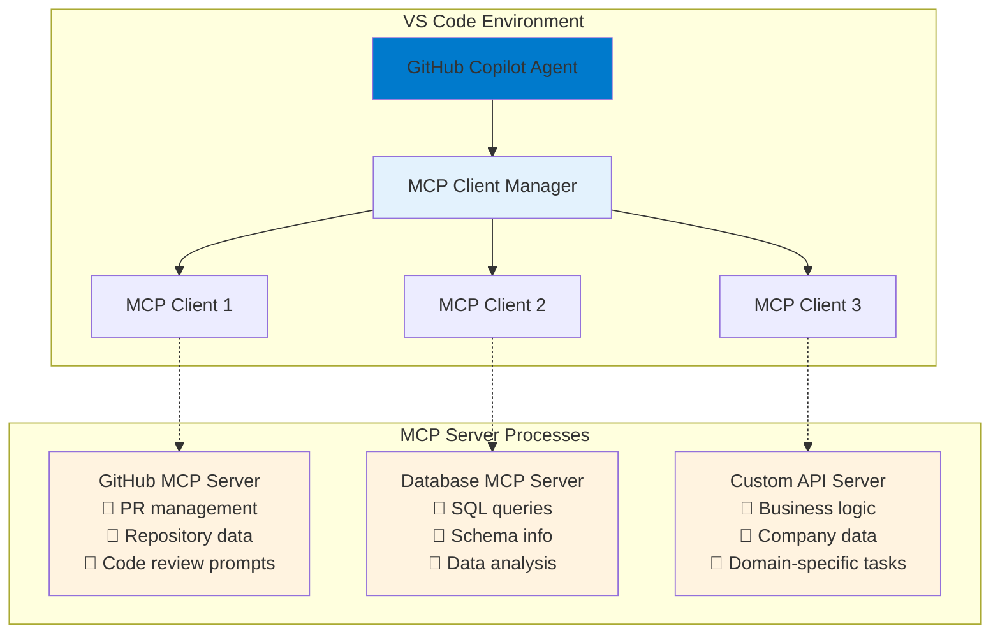

# 🧠 Lesson 4.1: Understanding Model Context Protocol (MCP) in VS Code

---

## 📝 Overview

**Goal:**  
Master Model Context Protocol (MCP) integration with VS Code and GitHub Copilot to extend AI capabilities with external tools, resources, and custom workflows.

**Estimated Duration:** 20-25 minutes

**Audience:**  
Developers using VS Code with GitHub Copilot who want to extend AI capabilities with external services and custom tools.

**Prerequisites:**
- VS Code with GitHub Copilot installed
- Basic understanding of GitHub Copilot Agent mode
- Familiarity with JSON configuration

---

## 🎯 Learning Objectives

By the end of this lesson, you will:

1. **Understand MCP architecture** and its role in AI tool integration
2. **Configure MCP servers** in VS Code for GitHub Copilot
3. **Use MCP tools, resources, and prompts** in Agent mode
4. **Manage and troubleshoot** MCP server configurations
5. **Recognize enterprise benefits** of standardized AI tool integration

---

## 🌐 What is Model Context Protocol (MCP)?

### **The Official Definition**
> *"The Model Context Protocol (MCP) is an open protocol that enables seamless integration between LLM applications and external data sources and tools. Whether you're building an AI-powered IDE, enhancing a chat interface, or creating custom AI workflows, MCP provides a standardized way to connect LLMs with the context they need."*

### **In Simple Terms**
MCP is like **USB for AI tools** - a universal standard that allows any AI application to connect to any data source or service without custom integration code.

---

## 🏗️ MCP Architecture in VS Code



### **Communication Flow**
1. **VS Code launches MCP servers** as separate processes
2. **JSON-RPC over stdio/HTTP** handles communication
3. **GitHub Copilot Agent** orchestrates tool usage
4. **User confirmation** required for potentially dangerous operations

---

## ⚙️ Configuring MCP in VS Code

### **Prerequisites Setup**
Enable MCP support in VS Code settings:

```json
{
  "github.copilot.chat.experimental.mcpServers": true
}
```

### **Configuration File Location**
Create `.vscode/mcp.json` in your workspace or user profile:

**Workspace-specific:** `.vscode/mcp.json`  
**User-global:** `~/.vscode/mcp.json` (macOS/Linux) or `%APPDATA%/Code/User/mcp.json` (Windows)

### **Basic Configuration Format**
```json
{
  "servers": {
    "github": {
      "type": "stdio",
      "command": "uvx",
      "args": ["mcp-server-github"],
      "env": {
        "GITHUB_PERSONAL_ACCESS_TOKEN": "your_token_here"
      }
    },
    "fetch": {
      "type": "stdio", 
      "command": "uvx",
      "args": ["mcp-server-fetch"]
    },
    "database": {
      "type": "sse",
      "url": "http://localhost:3001/sse",
      "headers": {
        "Authorization": "Bearer your_token"
      }
    }
  }
}
```

### **Server Types**
- **`stdio`:** Local process communication via standard input/output
- **`sse`:** Remote server communication via Server-Sent Events
- **`docker`:** Containerized MCP servers (if Docker available)

---

## 🛠️ Using MCP Tools in Agent Mode

### **Activating MCP Tools**

1. **Open Chat view** (⌃⌘I / Ctrl+Alt+I)
2. **Select Agent mode** from the dropdown
3. **Click Tools button** to see available MCP tools
4. **Toggle specific tools** on/off as needed

### **Direct Tool Reference**
Reference tools directly in prompts using `#` syntax:
```text
"Deploy the authentication service using #aws-deploy and create a PR with #github"
```

### **Tool Confirmation Flow**
When MCP tools are invoked:
1. **Tool execution prompt** appears
2. **Review tool parameters** before execution
3. **Choose confirmation level:**
   - **Continue Once:** Execute this time only
   - **Continue for Session:** Auto-approve for current session
   - **Continue for Workspace:** Auto-approve for this workspace
   - **Continue Always:** Auto-approve globally

### **Example Tool Usage**
```text
User Prompt: "Create a pull request with the latest authentication improvements"

Agent Response:
🔧 Using GitHub MCP tool: create_pull_request
Parameters:
- title: "feat(auth): improve JWT token validation"
- body: "Enhanced security with token rotation and expiration handling"
- base: "main" 
- head: "feature/auth-improvements"

[Continue] [Edit Parameters] [Cancel]
```

---

## 📄 MCP Resources and Context

### **Adding MCP Resources**
1. **Select Add Context** > **MCP Resources**
2. **Choose resource type** from available servers
3. **Provide parameters** if required
4. **Resource content** is added to chat context

### **Example Resources**
```text
# Database schema information
Add Context > MCP Resources > Database Schema > "users table"

# GitHub repository information  
Add Context > MCP Resources > GitHub Repository > "microsoft/vscode"

# File system access
Add Context > MCP Resources > File System > "/path/to/configs"
```

### **Resource Usage in Prompts**
```text
"Analyze the database performance issues in the users table and suggest optimizations based on the current schema"

AI Response:
📄 Using Database MCP resource: users_table_schema
📊 Schema shows indexes on: id, email, created_at
🔍 Missing indexes detected on: last_login, account_status

Recommendations:
1. Add composite index on (account_status, last_login)
2. Consider partitioning by created_at for large datasets
3. Implement soft delete pattern instead of hard deletes
```

---

## 💬 MCP Prompts and Templates

### **Invoking MCP Prompts**
Use `/` followed by the prompt name:
```text
/mcp.github.code-review
/mcp.database.performance-analysis  
/mcp.aws.deployment-checklist
```

### **Prompt with Parameters**
```text
/mcp.github.create-release
> Release version: 2.1.0
> Release notes: Include authentication improvements and bug fixes
```

### **Custom MCP Prompts**
MCP servers can provide domain-specific prompts:
```json
{
  "prompts": [
    {
      "name": "security-audit",
      "description": "Perform security audit on codebase",
      "arguments": [
        {
          "name": "scope",
          "description": "Audit scope (full, auth, api)",
          "required": true
        }
      ]
    }
  ]
}
```

---

## 🎯 Tool Sets for Organization

### **Creating Tool Sets**
Group related MCP tools into sets for easier management:

```json
{
  "toolSets": {
    "development": {
      "tools": [
        "github.create_pr",
        "github.create_issue", 
        "database.execute_query",
        "aws.deploy_service"
      ]
    },
    "security": {
      "tools": [
        "security.scan_vulnerabilities",
        "github.security_audit",
        "aws.check_permissions"
      ]
    }
  }
}
```

### **Using Tool Sets**
```text
"Using the #development tool set, deploy the user authentication service and create a PR for review"
```

---

## 🔧 Managing MCP Servers

### **MCP Server Management Commands**
Use Command Palette (⌃⇧P / Ctrl+Shift+P):

- **`MCP: List Servers`** - View all configured servers
- **`MCP: Browse Resources`** - Explore available resources
- **`MCP: Restart Server`** - Restart a specific server
- **`MCP: Show Output`** - View server logs for debugging

### **Server Status Monitoring**
```text
Command: MCP: List Servers

Results:
✅ github - Running (3 tools, 5 resources available)
❌ database - Error (Connection timeout)
⏸️ aws - Stopped (Start manually)
🔄 custom-api - Restarting
```

### **Configuration Management**
VS Code provides editor support for `.vscode/mcp.json`:
- **Syntax highlighting** for JSON configuration
- **Command lenses** to start/stop/restart servers
- **Error validation** for configuration issues
- **IntelliSense** for known server types

---

## 🚨 Troubleshooting MCP Issues

### **Common Issues and Solutions**

**❌ MCP Server Error Indicator in Chat**
```text
Solution:
1. Click error notification in Chat view
2. Select "Show Output" to view logs
3. Check server configuration in mcp.json
4. Verify environment variables and permissions
```

**❌ Server Not Starting**
```text
Checklist:
□ Command path is correct (uvx, node, python)
□ Arguments are properly formatted
□ Environment variables are set
□ Network connectivity (for remote servers)
□ Permissions for file/directory access
```

**❌ Tools Not Appearing**
```text
Verification steps:
1. Ensure MCP experimental flag is enabled
2. Check server is running in MCP: List Servers
3. Verify tools are enabled in Agent mode
4. Restart VS Code if configuration changed
```

### **Development Mode for Custom Servers**
```json
{
  "servers": {
    "my-custom-server": {
      "command": "node",
      "args": ["build/index.js"],
      "dev": {
        "watch": "build/**/*.js",
        "debug": { "type": "node" }
      }
    }
  }
}
```

---

## 🏢 Enterprise Benefits in VS Code

### **🚀 Developer Productivity**
- **Unified AI interface** for all development tools
- **Context-aware assistance** with real project data
- **Automated workflows** through natural language
- **Reduced context switching** between tools

### **🔧 Standardization**
- **Consistent tool integration** across teams
- **Shared MCP configurations** in repositories
- **Standardized AI workflows** for common tasks
- **Centralized tool management** and updates

### **🔒 Security & Control**
- **Tool-level permissions** and confirmation prompts
- **Audit trails** for all AI-initiated actions
- **Isolated server processes** prevent cross-contamination
- **Enterprise authentication** integration

### **📈 Scalability**
- **Easy addition** of new capabilities
- **Team-wide tool sets** for consistency
- **Custom MCP servers** for internal APIs
- **Future-proof integration** architecture

---

## 🎯 Real-World VS Code Scenarios

### **Full-Stack Development Workflow**
```text
Prompt: "I need to add user profile editing to our app. Set up the full workflow."

Agent with MCP tools:
1. 🔧 database → Create user_profiles table with schema
2. 🔧 github → Create feature branch "user-profile-editing"  
3. 📄 codebase → Analyze existing user management patterns
4. 🔧 github → Generate API endpoints following project conventions
5. 🔧 github → Create React components with TypeScript
6. 🔧 testing → Generate unit and integration tests
7. 🔧 github → Create PR with comprehensive description
```

### **DevOps and Deployment**
```text
Prompt: "Deploy the authentication service to staging and monitor for issues"

Agent workflow:
1. 🔧 aws → Deploy to staging environment
2. 🔧 monitoring → Set up health checks and alerts
3. 🔧 github → Update deployment documentation
4. 🔧 slack → Notify team of deployment
5. 📄 logs → Monitor for first 10 minutes
6. 🔧 github → Create deployment success issue if all good
```

### **Security and Compliance**
```text
Prompt: "Audit our authentication system for security vulnerabilities"

Agent analysis:
1. 📄 codebase → Scan authentication-related files
2. 🔧 security-scanner → Run vulnerability analysis
3. 📄 dependencies → Check for known CVEs
4. 🔧 github → Review recent security-related PRs
5. 🔧 compliance → Generate security audit report
6. 🔧 jira → Create tickets for remediation items
```

---

## 🌟 Available MCP Servers for VS Code

### **Official Reference Servers**
Based on the [Model Context Protocol servers repository](https://github.com/modelcontextprotocol/servers), these are the officially maintained reference implementations:

**Development & DevOps:**
- **GitHub** - Repository management, PR automation, issue tracking
- **Git** - Local Git repository operations and history
- **Filesystem** - Secure file and directory operations
- **Docker** - Container management and deployment

**Databases & Data:**
- **PostgreSQL** - Database queries and schema management
- **SQLite** - Lightweight database operations
- **Memory** - Persistent key-value storage across sessions

**External Services:**
- **Fetch** - Web content retrieval for documentation and APIs
- **Brave Search** - Web search capabilities for real-time information
- **Google Drive** - Document access and collaboration
- **Slack** - Team communication and workflow integration

**Development Tools:**
- **Puppeteer** - Web automation and testing
- **Sentry** - Error monitoring and performance tracking
- **Everything** - Fast file search on Windows systems

### **VS Code Supported Servers**
For the complete VS Code MCP integration guide and supported servers, visit the [official VS Code MCP documentation](https://code.visualstudio.com/mcp).

### **Community Servers (700+ Available)**
The MCP ecosystem includes hundreds of community-built servers for:
- **Cloud Platforms:** AWS, Azure, GCP, DigitalOcean
- **Databases:** MySQL, MongoDB, Redis, ClickHouse
- **Business Apps:** Salesforce, HubSpot, Notion, Jira
- **AI/ML Platforms:** OpenAI, Hugging Face, Anthropic
- **Development Tools:** Kubernetes, Jenkins, Terraform

### **Enterprise Custom Servers**
- **Internal APIs** - Company-specific business logic
- **Legacy systems** - Bridge to older systems
- **Custom databases** - Proprietary data sources
- **Business workflows** - Domain-specific operations

---

## 🎓 Key Takeaways

### **MCP in VS Code Transforms Development by:**
1. **Extending GitHub Copilot** with unlimited external capabilities
2. **Standardizing tool integration** through a universal protocol
3. **Enabling complex workflows** through natural language
4. **Maintaining security** with confirmation and isolation
5. **Supporting custom tools** for enterprise needs

### **Best Practices:**
- **Start with official servers** (GitHub, Fetch) for reliability
- **Use workspace-specific configurations** for team consistency
- **Implement tool sets** for common workflow groupings
- **Monitor server logs** for troubleshooting and optimization
- **Train team members** on MCP prompt patterns and tool usage

### **When MCP Adds Value:**
✅ **Multi-tool workflows** requiring coordination  
✅ **Custom enterprise integrations** with internal systems  
✅ **Development automation** through AI assistance  
✅ **Complex data analysis** requiring multiple sources  
✅ **Deployment and operations** workflows  

---

## 🏃‍♀️ Ready for Hands-On Practice?

Now that you understand MCP in VS Code, let's put it into practice. In the next lesson, we'll:

1. **Configure GitHub MCP server** in VS Code
2. **Use Agent mode** with MCP tools for repository management
3. **Automate pull request workflows** with natural language
4. **Experience the power** of AI-driven development workflows

---

**Next:** [4.2 Hands-On Lab: GitHub MCP Integration →](./4.2-github-mcp-lab.md)

---

© Copyright Neudeisc 2025 