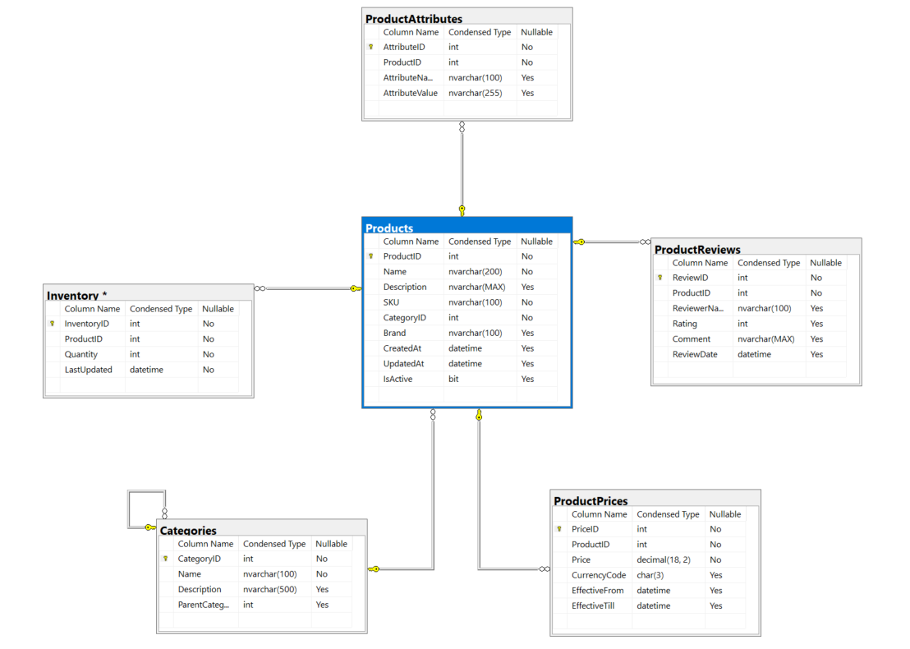

# Copilot Sample .NET 8 Full Stack API

## 1. What is this project about?
This repository is a Web API solution demonstrating a modern .NET 8 backend API for inventory and product management. It includes:
- **copilot-sample.Api**: ASP.NET Core Web API for managing products, categories, inventory, pricing, and reviews.
- **copilot-sample.DataAccess**: Data access layer using Entity Framework Core (EF Core) with SQLite (default) or SQL Server.
- **copilot-sample.Test**: Unit tests for API and services using xUnit, Moq, and FluentAssertions.

The project is designed for learning, prototyping, and as a reference for building scalable .NET 8 APIs with best practices.

**🚀 Quick Start**: After running the API, visit [http://localhost:5111/swagger](http://localhost:5111/swagger) to explore and test all endpoints!

## 2. Database Schema & Entities

This project implements a comprehensive inventory management system with the following entity relationships:



### Core Entities

#### 📦 **Categories**
- Hierarchical category structure with parent-child relationships
- Supports unlimited nesting levels (e.g., Electronics → Laptops → Gaming Laptops)
- Fields: `CategoryID`, `Name`, `Description`, `ParentCategoryID`

#### 🛍️ **Products**
- Core product information with category association
- Includes SKU management, branding, and lifecycle tracking
- Fields: `ProductID`, `Name`, `Description`, `SKU`, `CategoryID`, `Brand`, `CreatedAt`, `UpdatedAt`, `IsActive`

#### 💰 **ProductPrices**
- Time-based pricing with currency support
- Enables price history and future pricing schedules
- Fields: `PriceID`, `ProductID`, `Price`, `CurrencyCode`, `EffectiveFrom`, `EffectiveTill`

#### 📊 **Inventory**
- Real-time stock quantity tracking
- Last updated timestamps for inventory management
- Fields: `InventoryID`, `ProductID`, `Quantity`, `LastUpdated`

#### 🏷️ **ProductAttributes**
- Flexible key-value product specifications
- Supports dynamic product properties (Color, Size, Weight, etc.)
- Fields: `AttributeID`, `ProductID`, `AttributeName`, `AttributeValue`

#### ⭐ **ProductReviews**
- Customer review and rating system
- Rating validation (1-5 stars) with comments
- Fields: `ReviewID`, `ProductID`, `ReviewerName`, `Rating`, `Comment`, `ReviewDate`

### Entity Relationships

- **Categories**: Self-referencing hierarchy (Parent → Children)
- **Products**: Belongs to Category, has multiple Prices, Attributes, Reviews, and one Inventory record
- **Pricing**: Multiple price records per product for historical tracking
- **Inventory**: One-to-one with Products for current stock levels
- **Attributes**: Multiple dynamic properties per product
- **Reviews**: Multiple customer reviews per product

### Sample Data

The system comes pre-loaded with sample data including:
- **4 Categories**: Electronics (parent) with Laptops, Smartphones, Accessories (children)
- **7 Products**: Various electronics with different brands and specifications
- **Pricing**: Current prices in USD for all products
- **Inventory**: Stock quantities for each product
- **Attributes**: Technical specifications and features
- **Reviews**: Sample customer feedback with ratings

## 3. How is it setup?
- **Database**: Uses SQLite by default (see `copilot-sample.Api/DBSetup.md` for details). Can be switched to SQL Server.
- **Entity Framework Core**: Handles data access and migrations.
- **Dependency Injection**: All services are registered and injected using .NET's built-in DI.
- **Swagger**: API documentation and testing UI available at `/swagger` when running the API.
- **Unit Testing**: xUnit, Moq, and FluentAssertions for robust test coverage.

## 4. Dependencies
- [.NET 8 SDK](https://dotnet.microsoft.com/en-us/download/dotnet/8.0)
- ASP.NET Core 8
- Entity Framework Core 8 (with SQLite and InMemory providers)
- Swashbuckle.AspNetCore (Swagger)
- xUnit, Moq, FluentAssertions (for testing)

See each project's `.csproj` for full dependency details.

## 5. How to run it

### Build and Run the API

```bash
# Restore dependencies and build all projects
dotnet build

# Run the API (from the Api project directory)
cd copilot-sample.Api
dotnet run
```

The API will be available at `https://localhost:7111` or `http://localhost:5111` by default.

**🚀 Quick Start**: After running the API, visit [http://localhost:5111/swagger](http://localhost:5111/swagger) to explore and test all endpoints!

### Access Swagger UI

- **Swagger Documentation**: Available at [http://localhost:5111/swagger](http://localhost:5111/swagger) when running the API
- **HTTPS Swagger**: Available at [https://localhost:7111/swagger](https://localhost:7111/swagger) when using HTTPS

### Quick Start with Swagger

Once the API is running, you can:

1. Open [http://localhost:5111/swagger](http://localhost:5111/swagger) in your browser
2. Explore all available endpoints and their documentation
3. Test API endpoints directly from the Swagger UI
4. View request/response models and schemas

### Database Setup

- By default, the API will create a `inventory.db` SQLite file on first run.
- For advanced setup, migrations, or switching to SQL Server, see [`copilot-sample.Api/DBSetup.md`](copilot-sample.Api/DBSetup.md).

### Run Unit Tests

```bash
# From the solution root or Test project directory
dotnet test
```

---

For more details, see inline code comments, Swagger UI, and the `copilot-instructions.md` file for Copilot usage tips.
