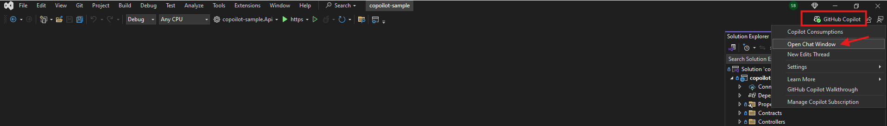
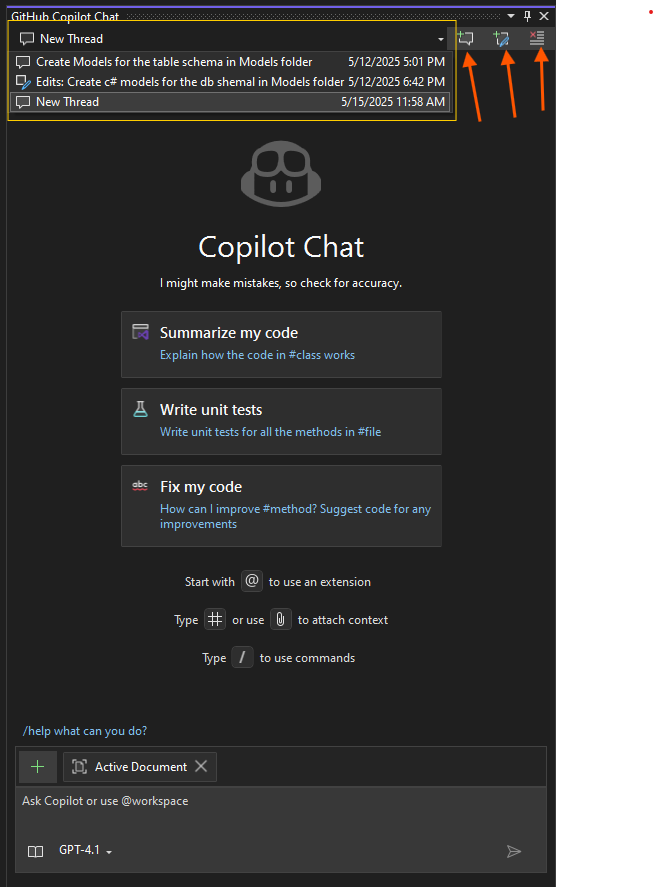

# Copilot Chat

To open the Copilot chat, click on the Copilot icon in the top right corner of the Visual Studio window.  
Refer: [Visual Studio GitHub Copilot Chat Documentation](https://learn.microsoft.com/en-us/visualstudio/ide/visual-studio-github-copilot-chat?view=vs-2022)



The GitHub Copilot chat window will open on the right side of the Visual Studio window. Its header has the following options:

1. **Chat thread dropdown:** Select a thread to view the chat history.
2. **Create new thread button:** Click to create a new chat thread.
3. **Edit thread button:** Click to edit the current thread.
4. **Delete thread button:** Click to delete the current thread.



## Ask Mode in Copilot

Open the Copilot chat thread and ask by clicking on the "Create new thread" button.

### Examples in Ask mode

1. **Explain the code:**

    ```text
    @workspace, Explain the DataAccess project in the solution. Also explain how it is being used and triggered.
    ```

2. **Ask Copilot to implement a feature:**

    ```text
    @workspace, In ProductService class, AddProductAsync method, add a check to see if the product already exists in the database. If it does, throw a custom exception named ProductAlreadyExistsException.
    ```

3. **Create a controller and service:**

    ```text
    @workspace, Create a controller for ProductReviews CRUD operations and add a service named ProductReviewService that implements IProductReviewService interface to handle DB operations and add it to DI. Also add necessary DTO models.
    ```

4. **Ask Copilot about an exception:**

    ```text
    Run GetProducts endpoint and check if there are any exceptions, and explore "Analyze with Copilot".
    ```

5. **Generate integration code:**

    ```text
    @workspace, I am trying to consume CategoryController endpoint in UI TypeScript project. It uses axios for HTTP calls, please generate TS code with interfaces.
    ```

## Edit Mode in Copilot

Click on the "Create new Edits thread" button to open the edit mode chat.

### Examples for edit mode

1. **Document the code:**

    ```text
    @workspace, Document the ProductAttributeService class and its methods.
    ```

2. **Implement a feature:**

    ```text
    @workspace, Create a controller for ProductReviews CRUD operations and add a service named ProductReviewService that implements IProductReviewService interface to handle DB operations and add it to DI. Also add necessary DTO models.
    ```

3. **Create unit tests:**

    ```text
    @workspace, Create unit tests for the ProductAttributeService class and its methods.
    ```

4. **Build deployments:**

    ```text
    I am planning to deploy the .net core api as a docker container on kubernetes, please help me generate the docker file. Also explain what each statement in the dockerfile does
    ```

## Inline Chat with Copilot

To open inline chat, select a code block and press `Alt + /`.

### Examples

1. **Explain a selected code block.**
2. **Ask Copilot to write code:**

    ```text
    In ProductService class, AddProductAsync method, select the method body and click "Alt + /" to open inline chat.
    Please add a check if the Category already exists in the database. If it does, throw an exception.
    ```
