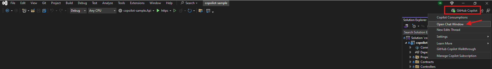
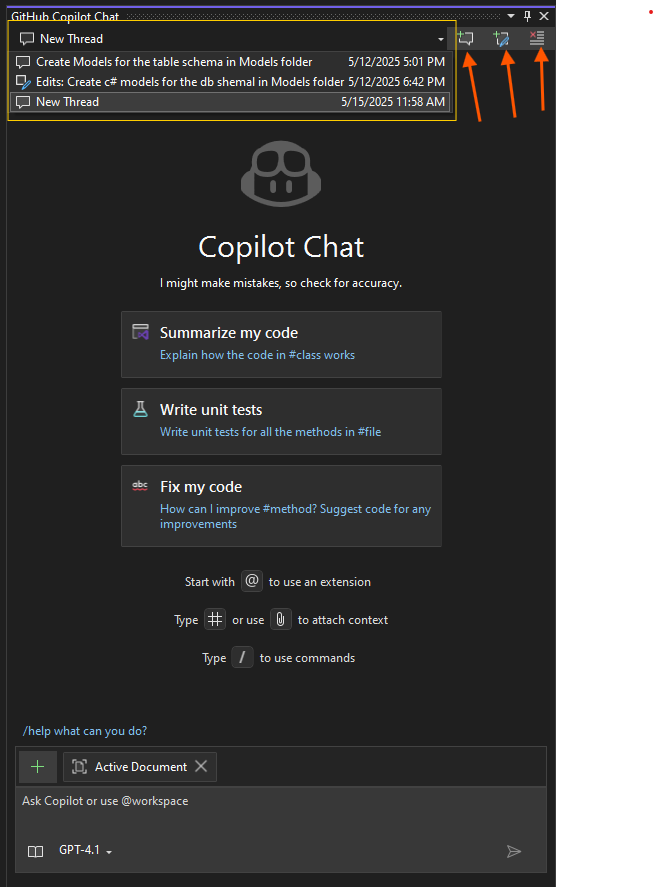

# Copoilot chat
To open the copilot chat, click on the copilot icon in the top right corner of the Visual Studio window.
Refer : https://learn.microsoft.com/en-us/visualstudio/ide/visual-studio-github-copilot-chat?view=vs-2022



The github copilot chat window will open on the right side of the Visual Studio window. and its header has the following options:
1. Chat thread dropdown: Select a thread to view the chat history.
1. Create new thread button: Click to create a new chat thread.
1. Edit thread button: Click to edit the current thread.
1. Delete thread button: Click to delete the current thread.

  


## Ask mode in Copilot
Open the copilot chat thread and ask by clicking on "Create new thread button".
1. 1. Explain the code: 
	```
	@workspace , Explain the DataAccess project in the solution. Also explain how is it being used and triggerred
	```
2. Ask copoilot to implement a feature:
	```
	 @workspace, In ProductService class, AddProductAsync method, add a check to see if the product already exists in the database. If it does, throw a custom exception named ProductAlreadyExistsException.
	```
3. Ask copilot to implement a feature:
	```
	@workspace , Create a controller for ProductReviews CRUD operations and add a service named ProductReviewService that implements IProductReviewService interface to handle db operations and add it to DI. 
	Also add necessary Dto models. 
	```
4. Ask copoilot about an exception:
	```
	Run GetProducts end point and check if there are any exceptions, and explore "Analyze with copoilot"
	```

## Edit Mode in Copoilot
Click on Create new Edits thread button to open the edit mode chat.
1. Document the code:
	```
	@workspace , Document the productAttributeService class and its methods. 
	```
2. Implement a feature: 
	 ```
	@workspace , Create a controller for ProductReviews CRUD operations and add a service named ProductReviewService that implements IProductReviewService interface to handle db operations and add it to DI. 
	Also add necessary Dto models. 
	```
3. Create unit tests for the code:
	```
	@workspace , Create unit tests for the ProductAttributeService class and its methods. 
	```

# Inline chat with copoilot
To open inline chat, select a code block and press "Alt + /".

1. Explain about a selected code:

2. Ask copoilot to write code:
	```
	In ProductService class, AddProductAsync method, select the method body and click "Alt + /" to open inline chat.
	Please add a check if teh Category already exists in the database. If it does, throw a exception.
	``` 

	